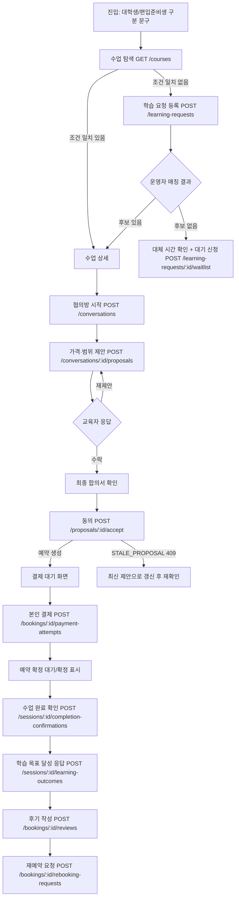
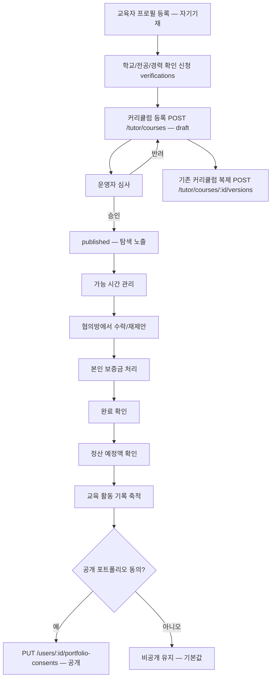
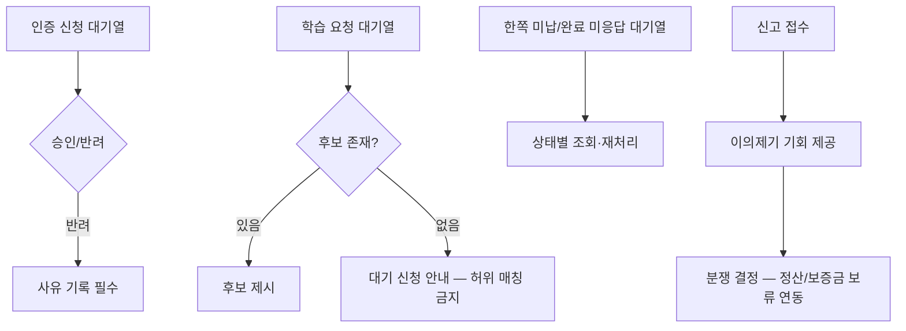

# 전공한시간 — 사용자 흐름 설계 (S02-T02)

작성: A3(UX·프론트엔드) · 작성일: 2026-09-19
입력: docs/product/requirements.md(P0 요구사항), packages/contracts/openapi.yaml(S02-T01)

## 1. 학습자: 탐색 → 협의 → 동의 → 예약

## 2. 교육자: 등록 → 수업 관리

## 3. 운영자: 심사 → 매칭 → 분쟁

## 4. 상태별 공통 화면 처리(모바일 우선)

| 상태 | 표시 방식 |
|---|---|
| 로딩 | 카드 스켈레톤(수업 목록·협의방), 버튼 비활성화(제안·결제 진행 중) |
| 빈 결과 | "조건에 맞는 수업이 없습니다" + 대체 시간 확인 버튼 + 대기 신청 버튼(허위로 결과를 만들지 않음) |
| 권한 오류(403) | "이 대화/예약에 접근할 수 없습니다" — 상세 사유는 노출하지 않고 목록으로 복귀 유도 |
| 오래된 제안(409 STALE_PROPOSAL) | "상대방이 새로운 제안을 보냈습니다" + 최신 제안으로 자동 스크롤, 기존 수락 버튼 비활성화 |
| 결제 확인 중(UNKNOWN) | "결제 확인 중입니다" 배지, 재청구 버튼 숨김, 새로고침/문의 안내만 제공 |

## 5. 매칭 실패 후속 행동 (SRC-03)

빈 결과 화면은 다음 두 경로를 항상 함께 제시한다: ① 가능한 다른 시간 확인(교육자 가능 시간 캘린더로 이동) ② 대기 신청 등록. 대기 신청 후에는 "신규 교육자 등록 시 안내드립니다"로 기대치를 관리하며, 매칭을 보장하는 문구를 사용하지 않는다.

## 6. 학습 전후 흐름(완료 결과·다음 단계·재예약·교육 활동)

완료 확인 이후 화면은 다음 순서로 이어진다: 완료 확인 → 목표 달성 자기응답(선택) → 후기 작성(완료된 경우만) → "다음에 필요한 학습" 안내(다음 단계는 교육자 확정 후에만 확정 제안으로 표시, AI 초안은 '초안' 배지 유지) → 동일 교육자 재예약 진입점. 이 흐름 어디에도 "합격/자격/취업"을 보장하는 문구를 넣지 않는다(acceptance-matrix.md §3).
