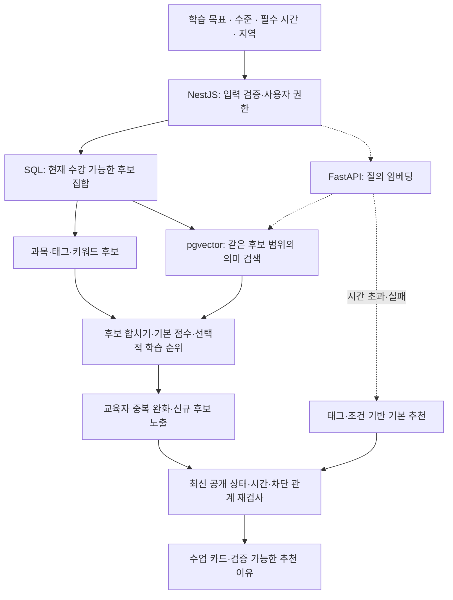

# 전공한시간 AI·추천 시스템 아키텍처

작성일: 2026-09-18 · 최종 정리: 2026-09-19 · 상태: 구현 제안 v1.0

상위 설계: [웹서비스 아키텍처](./전공한시간_웹서비스_아키텍처.md)

사용자의 ‘확장성을 고려하여 AI·추천 기능에 적합한 기술 스택을 정해 달라’는 요청을 반영했다. 본 문서는 추천 구조와 개발 순서를 결정하며 실제 모델 성능을 검증했다는 의미는 아니다.

## 1. 기술 스택 결정

| 구분 | 선택 | 맡길 역할 |
|---|---|---|
| 웹 | **Next.js + React + TypeScript** | 수업 탐색, 추천 이유, 협의·예약, 교육자·운영자 화면 |
| 업무 서버 | **NestJS + TypeScript** | 인증·권한, 추천 자격 필터, 기본 순위, 협의·예약·결제 |
| AI 서버 | **Python + FastAPI + Pydantic** | 목표 의미 해석, 임베딩 생성, 순위 모델 추론, 초안 생성 |
| 원본 DB | **PostgreSQL** | 사용자·수업·가능 시간·예약·거래·추천 이벤트 |
| 벡터 검색 | **pgvector** | 학습 목표와 커리큘럼의 의미 유사도 검색 |
| 관리형 기반 | **Supabase Auth / PostgreSQL / Storage** | 초기 인증·DB·파일 운영 |
| AI 실행 방식 | **외부 관리형 모델 API 우선, 교체 가능한 Adapter** | 초기 GPU·자체 모델 운영 부담 축소 |
| 장기 작업 | **영구 작업 큐 + Python worker** | 수업 임베딩 갱신, 대량 재색인, 오프라인 평가·학습 |
| 배포 | **웹·NestJS·FastAPI·worker 개별 배포** | AI 부하가 늘면 AI 실행 용량만 증설 |

**초기에 배포할 것은 웹·NestJS·PostgreSQL이다.** 이 단계에서 조건 기반 추천과 이벤트 수집을 구현한다. 의미 검색·AI 작성 보조를 추가할 때 FastAPI와 worker를 배포한다. 파일럿 초반에 AI 시연이 필요하다면 이 단계를 앞당기되, 예약의 정상 동작은 AI 가용성에 의존하지 않게 한다.

이 선택의 이점은 TypeScript로 서비스 기능을 일관되게 개발하면서, 이후 Python의 데이터 분석·모델 학습 코드를 서비스에 연결할 수 있다는 것이다. 비용은 언어와 배포 대상이 늘어나는 운영 복잡도다. 이를 줄이기 위해 업무 서버는 한 개의 모듈형 모놀리스로 유지한다.

PostgreSQL에 pgvector를 추가하면 일반 관계 데이터와 벡터 검색을 함께 관리할 수 있다. 별도 벡터 DB 도입은 실제 검색 규모와 지연을 측정한 뒤 결정한다. [Supabase AI·Vectors 공식 문서](https://supabase.com/docs/guides/ai)

## 2. 추천에서 풀 문제

> ‘목요일 저녁 학교 근처에서, 비전공자 수준으로 파이썬 표 데이터를 배우고 싶다’는 요청에, 실제로 상담·예약이 가능한 수업을 적합한 순서로 제시한다.

추천의 단위는 교육자 개인의 유명세보다 **교육자 + 공개 커리큘럼 + 가능한 수업 시간**이다. 프로필 소개가 유사하더라도 수업 범위·시간이 맞지 않으면 우선 후보가 아니다.

추천은 가격·일정 확정이나 교육 능력 보증을 뜻하지 않는다. 협의와 예약에서는 양측 합의와 최신 시간 점유를 다시 확인한다. 등록 희망가는 협의 시작 가격이며 최종 청구액이 아니다.

### 필수 조건과 선호 조건

| 필수 조건: 만족하지 않으면 제외 | 선호 조건: 순위에 반영 |
|---|---|
| 현재 공개·거래 가능 상태 | 학습 목표와 커리큘럼의 유사도 |
| 차단·이용 정지 관계 없음 | 자기신고 학습 수준과 설명 난이도 적합성 |
| 사용자가 필수로 지정한 생활권·시간 | 선호 시간과 이동 편의 |
| 수업 길이 전체를 확보할 수 있는 연속 시간 | 예산과 희망가의 근접도·협의 가능성 |
| 확정 예약·유효 점유와 겹치지 않음 | 응답성, 완료 이력, 후속 학습 연관성 |
| 수강 불가로 명시한 필수 선수지식 조건 | 신규 교육자의 탐색 노출과 결과 다양성 |

학습 수준 입력이 없거나 확인되지 않았다면 무조건 부적격으로 만들지 않고 ‘수준 확인 필요’로 표현한다. 사용자 본인이 명시한 절대 가격 필터와 단순 희망 예산을 구분한다. 희망가가 예산보다 높다는 이유만으로 모든 협의 가능 수업을 제거하지 않는다.

시간이 없으면 결과를 꾸며내지 않는다. ‘조건 일치 수업 없음’과 함께 시간 변경·대기 신청·운영자 요청 경로를 제시한다. 조건을 완화한 결과는 ‘다른 시간의 후보’로 구분하여 사용자에게 선택권을 준다.

## 3. 온라인 추천 흐름



1. NestJS가 구조화된 입력을 검증한다. 자연어에서 AI가 시간·장소를 추출했다면 사용자가 확인한 값을 기준으로 삼는다.
2. SQL로 공개 상태·관계·시간 조건에 맞는 수업을 선택한다. 초기 작은 후보군에서는 전체 적격 후보를 대상으로 순위를 계산한다.
3. 기본 검색은 과목·태그·동의어와 제목·목표를 사용한다. 한국어 표현과 영문 도구명 혼용을 포함한 평가 질의로 확인한다.
4. 의미 검색을 켰다면 질의를 벡터로 변환해 같은 적격 후보 안에서 비교한다. 임베딩이 없는 신규 수업도 기본 검색에는 포함한다.
5. 키워드와 의미 검색 결과를 합친다. 이후 기본 순위 또는 검증된 학습 모델로 정렬한다.
6. 동일 교육자의 유사 수업이 결과를 독점하지 않게 조정하고 신규 교육자에게 제한된 노출을 배분한다.
7. 노출 직전 현재 상태를 다시 검사한다. 추천 ID, 이유 코드, 요청 ID를 응답하고 결과 목록을 기록한다.

### 순위 계산의 첫 버전

초기에는 학습 데이터가 없으므로 이해 가능한 규칙을 사용한다. 아래 가중치는 구현·평가를 시작하기 위한 **가설**이며 효과가 검증된 수치는 아니다.

```text
적합도 점수 예시 =
  0.40 × 목표·수업 내용 적합도
  + 0.25 × 선호 시간 적합도
  + 0.15 × 수준 적합도
  + 0.10 × 이동 편의
  + 0.10 × 확인 가능한 운영 이력
```

각 입력은 정의된 기준으로 0~1 범위에 맞춘다. 후기 부족은 0점으로 취급하지 않고 중립값과 근거 부족 표시를 사용한다. 입력이 없는 신호는 임의로 최저점을 주지 않고 해당 항목을 제외해 가중치를 다시 정규화한다. 표본이 적은 평점·완료율은 전체 평균을 섞어 과도한 순위 변화를 줄인다.

키워드 점수와 벡터 유사도 원값을 그대로 합산하지 않는다. 검색 결과 간 결합에는 순위 기반 방식(RRF 등)을 사용하고, 평가 질의로 일치도를 확인한다. 결과가 한 검색기에만 있어도 명확한 규칙으로 포함한다. [Supabase 하이브리드 검색 공식 문서](https://supabase.com/docs/guides/ai/hybrid-search)

추천 이유는 검증된 값에서 만든다. 예: ‘목요일 19시 수업 가능’, ‘비전공자 입문 과정’, ‘파이썬 데이터 처리 목표 포함’. 확인되지 않은 교육 능력이나 합격 가능성을 만들어내지 않는다. 매 추천 요청마다 LLM으로 이유를 쓰게 할 필요는 없다.

## 4. 의미 검색과 데이터 갱신

### 임베딩할 데이터

교육자가 검토·공개한 수업 제목, 학습 대상, 선수지식, 목표, 커리큘럼, 결과물, 과목 태그를 사용한다. 실명·학교 인증 자료·연락처·계좌·신고·전체 채팅은 제외한다. 가격·예약 상태·가능 시간은 자주 바뀌므로 벡터 본문에만 의존하지 않고 SQL 필터·특징으로 유지한다.

| 테이블 | 필드 예시 | 용도 |
|---|---|---|
| `course_search_documents` | course_id, source_revision, public_text, tags, status | 검색 가능한 공개 수업 사본 |
| `course_embeddings` | course_id, source_revision, model_id, model_version, dimensions, preprocessing_version, embedding, generated_at | 재현 가능한 벡터 데이터 |
| `ai_jobs` | job_id, job_type, owner_id, source_revision, state, attempts, lease_until | 임베딩·초안 작업의 영구 상태 |
| `model_versions` | version, task, provider, model_id, dimensions, status, evaluation_ref | 모델·평가·활성 버전 관리 |
| `recommendation_requests` | request_id, filters, ranker_version, model_version, source, served_at | 어떤 조건·방식으로 추천했는지 기록 |
| `recommendation_impressions` | event_id, request_id, course_id, position, visible_at | 실제 화면에 노출된 수업 |
| `learning_events` | event_id, actor_key, request_id, course_id, event_type, occurred_at, ingested_at | 상세·상담·합의·완료 피드백 |

`recommendation_requests`에는 정제한 필터·태그 중심으로 저장한다. 사용자 자유문장에 개인정보가 들어갈 수 있으므로 원문 장기 저장은 기본값으로 삼지 않는다. 원문이 필요한 품질 조사에는 별도 목적·보관 기준을 정한다.

### 갱신 파이프라인

```text
수업 공개·수정 트랜잭션
  → source_revision 증가 + outbox 기록
  → 공개용 검색 문서 생성
  → Python worker가 필요한 본문 임베딩
  → 저장 직전 최신 revision·공개 상태 확인
  → 같은 버전인 경우만 활성 벡터로 반영
```

중복 이벤트는 `(course_id, source_revision, model_version)` 키로 제거한다. 오래된 작업이 늦게 끝나더라도 새 데이터를 덮어쓰지 않는다. 수업 비공개·삭제 시 검색·캐시에서 즉시 제외하고 파생 데이터 삭제 작업을 전파한다. 지연 재시도가 삭제 자료를 다시 만들지 않도록 삭제 표식과 최신 버전을 확인한다.

새 모델은 별도 버전으로 벡터를 생성하고 평가 후 활성 버전을 전환한다. 같은 차원이라도 다른 모델의 벡터를 섞지 않는다. 차원이 달라지면 별도 컬럼·테이블·인덱스를 사용한다. 전환 실패 시 이전 모델과 기본 추천으로 복구한다.

### 검색 성능 확장

초기에는 조건으로 줄인 후보를 대상으로 정확한 벡터 거리 계산을 사용한다. 실제로 느려질 때 HNSW 같은 근사 인덱스를 도입한다. 근사 검색에 필터를 조합하면 충분한 후보가 반환되지 않을 수 있으므로 더 넓은 검색·반복 스캔·정확 검색 보충을 평가한다. 필수 조건을 풀어서 결과 수를 채우지 않는다. [pgvector 공식 필터링 설명](https://github.com/pgvector/pgvector#filtering)

한국어 키워드 검색은 기본 영문 형태소 처리가 잘 작동한다고 가정하지 않는다. 초기는 과목 태그·수동 동의어·정규화한 제목 검색으로 시작하고, 한국어 질의에서 누락이 확인되면 별도 형태소 처리나 전용 검색엔진을 검토한다.

## 5. AI 서버와 업무 서버의 계약

AI 서비스는 계약·결제 원본을 수정할 권한이 없다. 외부에서 호출할 수 없는 내부 API로 운영하고 요청 ID, 호출자 인증, 제한 시간, 모델 버전을 공통 필드로 사용한다.

| 내부 기능 | 입력 | 출력 |
|---|---|---|
| `POST /internal/v1/embeddings/query` | 정제된 목표 문장, 활성 모델 버전 | 벡터, 차원, 모델·전처리 버전 |
| `POST /internal/v1/rank` | 후보 ID·허용 특징·요청 조건·특징 기준 시각 | 허용 후보 ID·점수·모델 버전 |
| `POST /internal/v1/drafts` | 작업 ID, 목표·수준·시간·교육자 제공 사실 | 작업 접수 결과 또는 검증된 초안 |
| `GET /internal/v1/jobs/:id` | 작업 ID | 상태, 스키마 검증된 결과·오류 |

NestJS는 AI가 반환한 후보가 허용 목록에 있는지, 점수가 유한한 수인지, 모델 버전·출력 개수가 맞는지 검사한다. 존재하지 않는 수업 ID, 비공개 수업, 근거 없는 추천 이유는 응답에 넣지 않는다.

AI DB 계정은 검색용 사본 조회와 AI 파생 테이블 수정만 허용한다. 거래 원장·인증 증빙·비공개 프로필 권한은 부여하지 않는다. 학습자는 NestJS를 거쳐 자기 초안·작업만 조회한다.

## 6. 장애 격리와 비용 제어

추천의 동기 경로에는 짧은 시간 예산을 둔다. 예를 들어 AI 단계에 700ms, 전체 추천에 1.5초를 내부 목표로 시작하되 실제 한국어 임베딩 지연과 배포 환경을 측정해 조정한다. 외부 호출 실패 시 즉시 기본 추천으로 전환하고, 반복 장애 시 일정 기간 AI 호출을 줄이는 차단기를 둔다.

생성형 초안은 `202 + job_id`로 접수하고 상태를 조회한다. 긴 작업은 영구 큐와 worker에서 실행한다. FastAPI의 요청 후 작업 기능만으로 중단 복구가 필요한 임베딩·학습 작업을 운영하지 않는다. [FastAPI 백그라운드 작업 공식 문서](https://fastapi.tiangolo.com/tutorial/background-tasks/)

초기 DB 작업 큐는 업무 작업과 AI 작업의 종류·동시 실행 수·DB 연결 한도를 분리한다. AI 대량 작업이 거래 연결을 소진하지 못하도록 한다. 지연·처리량이 문제가 되면 언어 간 계약을 정한 전용 큐를 도입한다. Node용 큐와 Python용 큐가 같은 Redis를 쓴다고 서로 작업 형식까지 호환된다고 가정하지 않는다.

| 실패 상황 | 사용자 경험 |
|---|---|
| 임베딩 API 지연·오류 | 태그·조건 기반 추천 유지 |
| 신규 수업 임베딩 생성 대기 | 기본 검색과 조건 추천에 포함 |
| Python 순위 모델 장애 | NestJS 규칙 순위로 전환 |
| 커리큘럼 생성 실패 | 입력한 초안 유지, 직접 작성 가능 |
| 비용 한도 도달 | 선택 AI 기능 제한, 탐색·협의·예약 유지 |
| 캐시의 수업 상태가 오래됨 | 최신 DB 검사로 부적격 후보 제거 |

임베딩은 본문 변경 시에만 재생성한다. 공개 텍스트 캐시는 모델·전처리·본문 해시로 구분한다. 민감한 사용자 질의 캐시는 계정별로 격리하거나 보관하지 않는다. 추천 결과 캐시는 사용자·필터·모델·정책 버전에 따라 구분하고, 노출과 예약 시 현재 권한·시간을 다시 확인한다.

이용자별 요청량, 생성 최대 길이, 모델 동시 실행 수, 월 비용 한도를 서버에서 관리한다. 측정 지표는 요청당 모델 비용, 임베딩 재생성 비용, AI 추천 지연, 기본 추천 전환율이다. 자체 GPU는 처리량·지속 비용·운영 인력을 비교한 후 도입한다.

## 7. 개인화에 필요한 이벤트

```text
recommendation_served      추천 결과가 서버에서 반환됨
recommendation_impression 카드가 실제 화면에 노출됨
course_detail_view        상세 조회
inquiry_started           상담 시작
proposal_agreed           최종 제안 합의
booking_funded            필요한 납부 의무 충족
lesson_completed          실제 수업 완료
booking_canceled          취소
refund_completed          실제 환불 완료
goal_feedback_submitted   수업 목표 달성 피드백
```

서버가 반환한 목록과 실제 본 목록을 구분한다. 중요 거래 이벤트는 DB 상태 변경과 outbox를 같은 트랜잭션에 기록한다. 클라이언트 노출·클릭은 중복 제거와 비정상 전송 제한을 적용하며, 결제·완료의 진실로 사용하지 않는다.

추천 요청 ID를 상세·협의·예약으로 전달한다. 직접 유입·운영자 수동 매칭도 별도 유입 경로로 기록한다. 동일 사용자가 여러 추천을 거쳤을 때 어떤 노출에 전환을 연결할지 분석 규칙을 버전으로 정한다.

저장할 특징은 추천 시점에 알 수 있었던 값이어야 한다. 미래에 생긴 후기·완료율·최종 협의 가격을 과거 추천 학습에 사용하지 않는다. 시간 기준으로 학습·평가 데이터를 나누고, 모델 학습용 추출 데이터와 기준 시각을 기록한다.

사용자의 학습 관심과 전환 이력은 공개 프로필 정보가 아니다. 개인화 목적·수집 범위를 알리고, 선택적 개인화를 끄더라도 입력 조건 기반 검색을 사용할 수 있게 한다. 분석 데이터는 가명 식별자를 사용하고 계정 삭제 요청의 전파 경로를 정의한다.

## 8. 추천을 발전시키는 순서

| 단계 | 방식 | 진행 조건 |
|---|---|---|
| R0 | 조건 필터 + 과목·태그 + 설명 가능한 규칙 | 서비스 최초 공개부터 가능 |
| R1 | R0 + 한국어 임베딩·키워드 결합 | 자연어 목표의 표현 차이로 놓치는 수업이 확인될 때 |
| R2 | 공개 정보 + 본인의 최근 관심·완료 주제를 활용한 개인화 규칙 | 충분한 재방문 사례와 개인화 목적의 데이터 확보 |
| R3 | Python의 학습 기반 순위 모델 | 조건별 노출·전환 데이터가 쌓이고 시간 분리 평가에서 개선 확인 |
| R4 | 고도화된 개인화·협업 필터링·탐색 전략 | 반복 이용과 공급 규모가 충분하고 실험 운영이 가능할 때 |

‘회원 N명부터 AI’ 같은 임의 기준으로 승격하지 않는다. 수업·주제·지역별로 노출과 완료 사례가 충분한지, 단순 기준보다 성능이 나아지는지, 신규 사용자에서도 작동하는지로 판단한다.

첫 학습 모델은 표 형태의 특징을 사용하는 순위 모델을 후보로 둔다. 모델 학습은 오프라인 worker에서 하고 승인된 버전만 FastAPI가 로드한다. 모델 파일은 전용 저장소·버전·체크섬·평가 결과와 연결한다. 온라인 요청 중 자동 재학습·활성 모델 교체를 하지 않는다.

후기·거래량이 많은 교육자에게만 추천이 몰리지 않게 신규 후보 노출과 같은 교육자의 결과 수를 관리한다. 클릭률만 최대화하지 않고 수업 성사·완료·목표 달성과 함께 판단한다.

## 9. 평가와 출시 기준

처음에는 실제 인터뷰에서 나온 목표와 표현 변형으로 30~50개 정도의 한국어 평가 질의를 만드는 것을 제안한다. 이는 기능 검증용 규모이며 시장 대표 표본이 아니다. 교육자·운영자가 후보 수업을 ‘부적합 / 관련 있음 / 적합’으로 판정하고 의견 차이를 기록한다.

| 평가 영역 | 지표·검증 |
|---|---|
| 조건 정확성 | 필수 시간·지역·공개 상태·차단 위반 0건 |
| 검색 적합도 | 상위 K개에 적합 수업이 포함되는 비율, Recall@K·NDCG@K |
| 후보 공백 | 조건 일치 후보 존재 여부와 실제 반환 공백률 비교 |
| 서비스 성과 | 실제 노출 대비 상담·합의·수업 완료 전환, 취소·환불·노쇼 |
| 공급 다양성 | 신규 교육자 노출, 교육자별 노출 집중도 |
| 운영 | 응답 지연, 실패·기본 추천 전환율, 요청당 비용 |
| 작성 보조 | 목표·시간·선수지식 충족, 사실 밖 경력·자격 생성 여부 |

소수 파일럿에서는 분자·분모와 사례를 함께 보고한다. 충분한 트래픽이 생기면 이용자 단위로 실험군을 고정해 기존 추천과 비교한다. 위치 편향을 파악하도록 실제 노출 순위를 저장하고 클릭하지 않은 항목을 무조건 부적합 정답으로 취급하지 않는다.

모델 배포 전에는 기존 방식과 같은 요청을 뒤에서 비교하고, 소수 트래픽에서 확인한 후 확대한다. 필수 조건 위반, 완료 전환 저하, 비용·지연 한도 초과가 발견되면 기본 추천으로 되돌린다. 작은 표본의 수치 변동을 성능 향상으로 확정하지 않는다.

## 10. 생성형 AI의 허용 범위

| 기능 | AI 입력 | 사용자 확인 후 적용할 결과 |
|---|---|---|
| 커리큘럼 초안 | 교육자가 준 주제·대상·선수지식·시간·목표 | 차시 구성·학습 목표·예상 결과물 |
| 프로필 문장 정리 | 본인이 입력한 사실 | 소개 문장, 경력 추가 생성 금지 |
| 목표 입력 도움 | 학습자가 설명한 목적 | 검색용 태그·수준·목표 초안 |
| 다음 수업 제안 | 허용된 완료 주제·학습 피드백 | 후속 학습 주제, 예약 자동 생성 금지 |

커리큘럼에는 실제 수업 시간과 맞는 분량인지 규칙 검사를 추가한다. 생성 결과의 스키마와 길이·허용 필드를 검사하고, 원문 사실에 없는 자격·경력·인증 상태는 저장하지 않는다. AI 초안은 ‘초안’ 상태로 저장하고 교육자의 명시적 공개 행동이 있어야 수업 원본에 반영한다.

교육자가 입력한 수업 소개와 외부 자료는 비신뢰 입력이다. 자료 속 지시문이 모델의 권한을 바꾸지 못하도록 도구 호출을 제한하고, 생성 기능에 결제·인증·예약 변경 도구를 제공하지 않는다. 추천 시스템에는 허용된 후보 ID만 반환하도록 계약을 둔다.

특정 모델 브랜드·크기를 구조에 고정하지 않는다. 한국어 목표 이해, 수업 내용과의 관련성, 구조화된 출력, 지연·비용·데이터 처리 조건을 같은 평가셋으로 비교해 모델을 선택한다. **기술 스택은 위 구성으로 결정하고, 모델 제품은 측정 후 선택하는 구현 항목으로 남긴다.**
