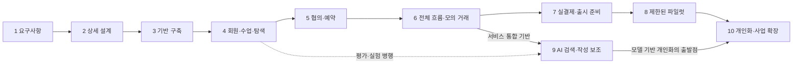

# 전공한시간 단계별 소프트웨어 개발 로드맵

작성일: 2026-09-19 · 상태: 개발 계획 v1.0

기준 문서: [웹서비스 아키텍처](./전공한시간_웹서비스_아키텍처.md), [AI·추천 아키텍처](./전공한시간_AI_추천_아키텍처.md), [사업계획서](./전공한시간_MVP_사업계획서.md)

AI 에이전트에게 작업을 배분할 때는 [역할별 개발 분담](./전공한시간_AI_Agent_역할별_개발_분담.md)의 담당 범위·파일 소유권·배분 순서·작업 카드 양식을 함께 사용한다.

현재 작성된 결과물은 사업계획서와 아키텍처 문서다. 아래 개발 작업과 검증은 모두 앞으로 수행할 계획이며, 완료된 구현을 뜻하지 않는다.

## 1. 개발 방향과 전체 단계

**실제로 예약이 성사되는 핵심 기능을 만든 뒤, 운영 가능한 거래 처리와 AI 추천을 연결한다.** 학습자·교육자·운영자 화면을 따로 완성한 후 연결하기보다 ‘수업 등록→탐색→협의→예약’처럼 사용자 행동 하나가 화면·API·DB를 끝까지 통과하도록 개발한다.

기술 기준은 Next.js 웹, NestJS 업무 서버, PostgreSQL, Supabase 인증·파일 보관이며, 의미 검색·생성 보조 도입 시 Python/FastAPI와 pgvector를 활성화한다. 첫 파일럿 범위는 1:1·단일 차시·한 생활권을 제안한다.

| 단계 | 목적 | 주요 산출물 | 다음 단계로 넘어갈 기준 |
|---|---|---|---|
| 1. 요구사항·정책 정리 | 무엇을 만들지 결정 | 요구사항 명세, 우선순위, 정책 결정표 | 첫 예약 시나리오와 범위가 명확함 |
| 2. 화면·DB·API 상세 설계 | 구현 계약 결정 | 화면 흐름, ERD 보완, API 명세, 상태 전이표 | 같은 입력과 상태에 대해 화면·서버가 같은 결과를 기대함 |
| 3. 프로젝트 기반 구축 | 반복 개발·검증 가능한 환경 | 저장소, 실행 환경, 인증 기반, CI, DB migration | 새 환경에서 실행·빌드·DB 생성 가능 |
| 4. 회원·수업·탐색 구현 | 상담할 수 있는 공급 확보 | 회원·프로필·수업·가능 시간·기본 추천 | 학습자가 조건에 맞는 수업을 찾고 상담 시작 가능 |
| 5. 협의·예약 구현 | 합의 내용을 예약으로 연결 | 메시지, 제안 버전, 동의, 예약·시간 점유 | 최신안에 양측이 동의한 예약이 중복 없이 생성됨 |
| 6. 수업·운영 흐름 완성 | 모의 거래로 전체 서비스 검증 | 모의 결제, 완료·취소·후기, 운영 화면, 이벤트 | 정상·예외 흐름을 처음부터 끝까지 시연 가능 |
| 7. 실제 결제·출시 준비 | 실제 거래를 처리할 준비 | PG 연동, 보증금·환불·정산, 권한·복구 검증 | 거래 오류 복구와 운영 책임이 준비됨 |
| 8. 제한된 파일럿 | 실제 사용으로 문제 확인 | 소수 사용자 운영, 장애·전환·완료 분석 | 거래 정확성을 유지하며 핵심 이용 문제를 개선함 |
| 9. AI 의미 검색·작성 보조 | 자연어 목표 이해와 작성 지원 | 임베딩, 의미 검색, 초안 생성, 평가셋 | 기본 방식 대비 유용성을 확인하고 실패 시 복구 가능 |
| 10. 개인화·사업 확장 | 검증된 수요에 맞춰 고도화 | 개인화, 그룹·복수 차시, 필요한 성능 개선 | 각 기능의 데이터·운영 조건과 효과가 확인됨 |

단계 번호는 권장 순서다. 9단계의 AI 평가·실험은 4단계 이후 별도 테스트 환경에서 병행할 수 있고, 사용자에게 제공하는 기능은 6단계의 권한·작업 상태·오류 처리 기반과 연결한다. 실제 모델을 학습하는 개인화는 충분한 데이터가 필요하다.



팀의 개발 경험·투입 시간·외부 계약 일정을 아직 모르므로 전체 기간을 확정하지 않는다. 사업계획서의 10시간 목표는 축소된 시연물에 해당하며, 아래 유료 서비스 개발 전체 일정으로 해석하지 않는다.

## 2. 1단계 — 요구사항과 정책 정리

**목표:** 개발자가 구현 여부를 판단할 수 있도록 사업 아이디어를 사용자 행동과 규칙으로 바꾼다.

**작업**

- 학습자·교육자·운영자의 사용자 시나리오를 작성한다.
- 첫 구현 범위를 1:1, 단일 수업, 직접 입력한 가능 시간, 확인된 장소 목록으로 정리한다.
- 기능을 필수 기능(P0), 파일럿 개선(P1), 확장 기능(P2)으로 구분한다.
- 확정 규칙과 미정 정책을 나눈다. 교육자 수수료 15%·학습자 플랫폼 수수료 0원은 반영하고, 보증금 비율·취소 기한·가격 하한은 정책으로 관리한다.
- 결제 대기 시간, 한쪽만 납부한 예약, 완료 미응답, 분쟁·정산 기준을 결정표에 남긴다.
- 각 요구사항에 ID와 검증 방법을 붙인다. 예: `NEG-003 이전 제안 수락 차단`.

**산출물:** 기능 요구사항 명세, MVP 범위표, 정책 결정표, 사용자 시나리오, 초기 개발 목록.

**완료 기준:** 어떤 조건에서 상담·예약·결제가 가능한지 설명할 수 있고, 미정 항목마다 영향 범위와 결정 시점이 표시되어 있다. 실거래 정책이 미정이어도 모의 구현은 진행하되 7단계 운영 활성화 조건으로 추적한다.

## 3. 2단계 — 화면·데이터·API 상세 설계

**선행 조건:** 1단계의 핵심 시나리오와 P0 범위.

**작업**

- 수업 탐색→상세→협의→최종 합의→예약→내 수업의 화면 흐름을 설계한다.
- 교육자 수업 등록·가능 시간·정산 화면과 운영자 심사·매칭·분쟁 화면을 설계한다.
- 로딩·빈 목록·권한 없음·오래된 제안·결제 결과 확인 중 상태를 포함한다.
- 아키텍처 ERD를 실제 컬럼·외래키·인덱스·고유 제약·시간 중복 제약으로 상세화한다.
- 제안·예약·결제·환불·보증금·정산 각각의 상태와 전이 권한을 정의한다.
- API 요청·응답·오류 코드·권한·멱등키를 OpenAPI 명세로 정리한다.
- 시간대, 정수 원 단위 금액, 수수료 반올림, 과거 정책 보존 방식을 확정한다.
- 공개 프로필·예약 상대방 정보·인증 증빙의 접근 범위를 구분한다.

**산출물:** 와이어프레임, 화면 목록, 상세 ERD, API 명세, 상태 전이표, 권한표.

**완료 기준:** 같은 제안을 어느 화면에서 확인해도 커리큘럼·시간·가격이 같고, 잘못된 상태 요청을 서버가 어떻게 거절하는지 명시되어 있다. 확장 기능의 상세 명세는 구현할 단계에서 보완하며 초기 설계의 완료 조건으로 묶지 않는다.

## 4. 3단계 — 프로젝트와 개발 환경 구축

**선행 조건:** 2단계의 초기 API·DB 계약.

**작업**

- 한 저장소에 `apps/web`, `apps/api`, `packages/contracts`, `db/migrations`, `tests`를 구성한다.
- Next.js·NestJS·TypeScript의 실행·빌드·형식 검사 명령을 통일한다.
- 로컬·데모/스테이징·운영의 DB·Storage·인증·결제 설정을 분리한다.
- 환경변수 예시 파일과 비밀키 주입 방식을 구성한다.
- DB migration과 데모 전용 seed를 만든다. 초기부터 운영 데이터와 예시 데이터를 구분한다.
- 로그인 세션 검증, 업무 권한 검사 기반, 공통 오류·요청 ID·로그 처리를 구현한다.
- 코드 변경 시 형식 검사·타입 검사·관련 테스트·빌드를 수행하는 CI를 구성한다.
- 스테이징 배포, 상태 확인, 배포 실패 시 이전 버전으로 복구하는 기본 절차를 만든다.

**산출물:** 실행 가능한 기본 프로젝트, 개발 README, CI, 초기 migration, 환경 설정 예시, 스테이징.

**완료 기준:** 문서만 보고 새 개발 환경에서 웹·API·DB를 실행할 수 있고 CI가 통과한다. 브라우저에 서버 비밀키가 포함되지 않는다. Python 모델 서버와 대규모 인프라는 아직 필수 배포 대상이 아니다.

## 5. 4단계 — 회원·교육자·수업·탐색

**선행 조건:** 3단계의 인증·DB·실행 기반.

**구현 순서**

1. 회원 가입·로그인·내 정보와 학습자/교육자 복수 역할.
2. 교육자 프로필·수업 가능 과목·경력 입력과 운영자 심사.
3. 수업 커리큘럼·선수지식·희망가·장소 범위 등록·수정·비공개 전환.
4. 교육자 가능 시간 등록과 조회.
5. 수업 목록·상세·주제·생활권·시간 조건 탐색.
6. 조건·태그 기반 기본 추천과 검증 가능한 추천 이유.
7. 학습 요청 등록, 운영자 후보 제시, 매칭 실패·대기 처리.
8. 추천 요청·실제 노출·상세 조회·상담 시작 이벤트 기록.

**산출물:** 실제 계정으로 사용할 수 있는 프로필·수업 등록·탐색·요청 기능, 기본 추천, 최소 운영 화면.

**완료 기준**

- 교육자가 수업을 등록하고 학습자가 찾아 상담 진입점을 사용할 수 있다.
- 편입준비생도 대학 재학을 필수 조건으로 요구받지 않고 학습자로 가입할 수 있다.
- 공개 API에서 실명·연락처·인증 자료가 노출되지 않는다.
- 본인 소유가 아닌 수업은 수정할 수 없다.
- 조건 일치 수업이 없으면 대기·요청 경로를 안내하고 일치하지 않는 수업을 일치한다고 표시하지 않는다.
- 임베딩이나 후기 데이터가 없어도 기본 탐색·추천이 동작한다.

## 6. 5단계 — 채팅 협의와 예약

**선행 조건:** 4단계의 사용자·수업·시간 정보와 권한.

**구현 순서**

1. 참여자만 접근할 수 있는 협의방과 텍스트 메시지 저장·조회.
2. 목표·시간·장소·커리큘럼·가격·정책을 담은 제안 카드.
3. 제안·재제안 버전 관리와 이전 제안 무효화.
4. 정확한 제안 버전에 대한 양측 동의 기록.
5. 최종 수락 시 예약 스냅샷·참여자·수업 회차·납부 의무·시간 점유 생성.
6. 예약 상세·내 예약과 결제 대기 상태 화면.
7. 동의 후 조건 수정은 변경 요청으로 유도하고 기존 예약 직접 수정 차단.

**산출물:** 수업 탐색→협의→합의→예약이 연결되는 첫 핵심 시연물.

**완료 기준**

- 수락 버튼을 여러 번 눌러도 예약은 한 번만 생성된다.
- 재제안 직전 열린 화면에서 이전 제안을 수락할 수 없다.
- 같은 사용자의 겹치는 수업 시간은 DB 제약으로 막는다.
- 예약 생성 후 제안·정책·수업 원본을 변경해도 예약 명세가 바뀌지 않는다.
- 다른 협의방 ID로 메시지·제안에 접근할 수 없다.
- 합의 완료와 납부 완료에 따른 예약 확정을 화면에서 구분한다.

검증은 금액·버전 규칙 단위 테스트, 실제 PostgreSQL 동시성 테스트, 두 역할의 브라우저 흐름 테스트로 수행한다.

## 7. 6단계 — 모의 거래와 수업·운영 흐름 완성

**선행 조건:** 5단계의 예약·납부 의무·상태 모델.

**작업**

- `FakePaymentGateway`로 결제 성공·실패·결과 확인 중·환불 결과를 재현한다.
- 학습자 수업료와 양측 보증금을 분리하고, 필요한 의무가 모두 충족돼야 예약을 확정한다.
- 수업 완료 확인, 한쪽 미응답, 취소 요청, 노쇼 신고·분쟁 대기 흐름을 구현한다.
- 실제 완료 예약의 후기 작성과 교육자 활동 기록을 구현한다.
- 운영자가 인증·수동 매칭·분쟁·환불·지급 실패를 확인하고 사유를 남기는 화면을 만든다.
- outbox·작업 큐·재시도·만료 처리·알림을 연결하고 작업 중단 후 재실행을 확인한다.
- 원장의 금액 일치, 보증금 반환·보상 한도, 정산 보류 조건을 모의 결과로 검증한다.
- 합의·납부·완료·취소·환불 이벤트를 DB 상태 변경과 연결한다.
- 추천 노출부터 상담·예약·완료까지 연결되는 최소 지표 화면을 만든다.

**산출물:** 모의 결제로 전체 사용자 여정과 운영 예외를 확인할 수 있는 통합 MVP.

**완료 기준:** 정상 완료뿐 아니라 한쪽 미납·취소·분쟁·작업 실패를 운영자가 처리할 수 있다. 데모에 모의 결제·예시 데이터 표시가 있고 실제 거래 실적으로 집계하지 않는다.

**첫 제품 검토 지점:** 이 단계에서 실제 사용자에게 화면을 사용하게 하고, 최종 가격·보증금·수락·예약 상태를 이해하는지 확인한다. 이해 문제가 크면 7단계 전에 화면과 흐름을 수정한다.

## 8. 7단계 — 실제 결제 연동과 출시 준비

**선행 조건:** 6단계의 모의 거래 검증과 실제 자금 처리 정책·제공자 지원 범위 확인.

**구현 순서**

1. 결제 제공자의 테스트 환경을 기존 Adapter에 연결한다.
2. 서버 주문·금액 검증, 승인, 상태 조회, 원결제 취소·환불을 구현한다.
3. 멱등키와 이벤트 중복·순서 역전·결과 불명 복구를 검증한다.
4. 확인된 방식으로 학습자·교육자 보증금 수납·반환·보상을 연결한다.
5. 교육자 정산 계산과 실제 지급 요청·성공·실패를 구분해 연결한다.
6. 내부 원장과 제공자 결제·환불·지급 기록을 대조하는 절차를 만든다.
7. 인증 자료 관리·운영자 권한·신고·차단·감사 로그를 출시 기준으로 검증한다.
8. 백업 복원·작업 큐 복구·장애 알림·배포 복구·실거래 기능 중단 절차를 시험한다.

**산출물:** 테스트 연동된 결제·환불·정산, 운영 절차서, 대사 화면, 출시 점검 결과.

**실제 거래 활성화 기준**

- 동일 승인·웹훅·재시도로 중복 수납·환불·지급이 발생하지 않는다.
- 결제 성공 후 서버 응답이 유실되어도 제공자 조회로 복구한다.
- 양측 납부 조건이 충족되지 않은 예약을 확정하지 않는다.
- 만료된 예약의 늦은 결제 성공을 기존 예약 부활로 처리하지 않는다.
- 분쟁 검토 중 관련 정산·보증금 지급을 막고 운영 결정 기록을 남긴다.
- 실제 보증금 처리·환불·지급 방식과 취소 정책이 확정되어 있다.
- 운영 담당자가 실패 거래를 조회·재처리·중단할 수 있다.
- 운영 환경에서 데모 결제나 예시 거래를 생성하는 설정을 차단한다.

PG 계약·심사와 운영 정책 결정은 1단계부터 병행할 외부 준비 작업이다. 지연되면 해당 실거래 기능은 모의 상태로 유지하되, 나머지 제품 개발과 AI 실험은 진행할 수 있다. 보증금을 실제로 처리할 수 없다면 미납 예약을 확정하는 방식으로 우회하지 않는다.

## 9. 8단계 — 제한된 파일럿과 개선

**선행 조건:** 7단계의 실거래·운영 준비 기준 충족.

**작업**

- 한 생활권·소수 과목·초기 참여자로 이용 범위를 제한한다.
- 사업계획서의 교육자 3~5명, 학습자 약 10명, 유료 수강 5~10건은 파일럿 모집 목표로 참고한다. 이미 확보된 사용자나 실적으로 표현하지 않는다.
- 상담 응답, 합의·예약 전환, 완료율, 취소·노쇼, 실제 비용, 재예약을 관찰한다.
- 운영자가 매일 미납·미응답·환불 실패·지급 실패·분쟁 대기 항목을 확인한다.
- 화면 사용성, 시간 불일치, 가격 차이, 등록 이탈 원인을 기록하고 우선순위를 정한다.
- 거래 정확성·개인정보·운영 중단 문제를 먼저 수정하고 관련 검증을 다시 실행한다.

**산출물:** 파일럿 운영 기록, 결함 목록, 사용성 개선 목록, 실제 지표, 다음 개발 우선순위.

**완료 기준:** 거래 기록과 외부 금액이 일치하고 미해결 중요 결함의 처리 방안이 마련되어 있다. 소수 표본에서는 비율 옆에 실제 건수를 표시한다. 전환이 낮다면 추천 모델 개발 전에 공급 시간·가격·설명·사용 흐름의 문제인지 구분한다.

## 10. 9단계 — AI 의미 검색과 작성 보조

**선행 조건:** 4단계의 공개 수업·기본 추천, 서비스 통합에는 6단계의 권한·작업 상태·오류 처리 기반. 7~8단계와 개발을 병행할 수 있다.

**구현 순서**

1. 실제 학습 목표를 바탕으로 한국어 평가 질의와 적합 수업 판정 기준을 만든다.
2. Python/FastAPI 프로젝트와 내부 API 인증·출력 스키마·모델 Adapter를 구성한다.
3. 공개 수업의 검색용 사본과 pgvector 저장 구조를 추가한다.
4. 수업 공개·수정·비공개·삭제 이벤트에 임베딩 생성·갱신·삭제를 연결한다.
5. 태그·키워드와 의미 검색 후보를 합치고, 최신 공개·시간·차단 조건을 재검사한다.
6. 요청 제한 시간·비용 한도·실패 시 기본 추천 전환을 구현한다.
7. 교육자가 검토 후 확정하는 커리큘럼·프로필 초안 생성 작업을 추가한다.
8. 모델·전처리·본문 버전 관리와 소규모 배포·이전 방식 복구를 검증한다.

**산출물:** 자연어 목표 검색, AI 초안 기능, 평가셋·평가 결과, 모델 버전·비용·지연 모니터링.

**완료 기준**

- 기존 조건·태그 추천과 동일 평가 질의로 비교하고 유용성을 확인한다.
- AI가 적격 후보 밖의 수업을 반환해도 사용자에게 노출하지 않는다.
- AI가 응답하지 않아도 탐색·협의·예약·결제가 동작한다.
- 비공개·삭제된 수업과 오래된 벡터가 추천에 남지 않는다.
- 신분증·계좌·전체 채팅을 기본 임베딩이나 생성 입력에 보내지 않는다.
- AI 초안은 자동 공개하지 않고 교육자가 검토해 확정한다.

이 단계는 외부 모델과 콘텐츠 기반 추천을 사용하므로 많은 거래 데이터 없이도 시작할 수 있다. 학습한 개인화 모델의 도입과는 구분한다.

## 11. 10단계 — 데이터 기반 개인화와 사업 확장

이 단계의 작업은 한꺼번에 수행하는 목록이 아니다. 파일럿에서 확인한 문제와 수요에 따라 아래 작업 중 하나를 선택한다.

| 확장 작업 | 필요한 선행 조건 | 구현·검증 |
|---|---|---|
| 관심·완료 이력 개인화 | 재방문 사례와 허용된 이용 이력 | 본인 관심·완료 주제 활용, 개인화 해제 경로 |
| 학습 기반 추천 순위 | 충분한 노출·전환·완료 데이터와 평가 기반 | 시간 기준 학습·평가 분리, 기본 추천과 비교, 버전 복구 |
| 그룹 2~4명 | 그룹 수요·인원별 가격·마감·환불 정책 | 참여자별 동의·납부·출석, 최소 인원·좌석 동시성 |
| 복수 차시 | 회차별 가격 배분·부분 제공·취소 정책 | 회차별 완료·출석·부분 환불·활동 기록 |
| 실시간 채팅 | 폴링의 지연·비용 문제가 실제 확인됨 | 권한 있는 구독, 재접속 시 누락 메시지 복구 |
| 전용 worker·검색 인프라 | 측정된 처리량·DB·검색 병목 | 필요한 부분만 분리, 비용·지연·복구 절차 비교 |

**완료 기준:** 기능마다 기존 방식보다 무엇이 좋아졌는지 확인하고, 거래 정확성·사용자 권한·취소·환불 규칙을 유지한다. 사용자 수가 늘었다는 이유만으로 전체 서비스를 마이크로서비스로 분해하지 않는다.

## 12. 단계마다 반복할 개발 절차

각 기능은 아래 순서로 진행한다. 테스트를 마지막 단계에 한꺼번에 몰아두지 않는다.

1. **작업 정의:** 사용자가 하려는 행동, 입력·출력, 정상·실패 기준을 작업 카드에 적는다.
2. **상세 계약 확인:** 필요한 화면·API·DB·권한·상태 전이를 확인한다.
3. **구현:** DB migration과 서버 규칙을 구현하고 화면에서 실제 API를 연결한다. 화면 작업은 합의한 API 응답으로 먼저 진행할 수 있다.
4. **검증:** 금액·상태·권한·동시성처럼 중요한 규칙을 테스트하고 핵심 사용자 흐름을 확인한다.
5. **리뷰:** 요구사항 충족, 데이터 접근, 예외 처리, 운영자 복구 가능성을 점검한다.
6. **스테이징 확인:** 실제 배포 환경에서 대표 사용자 역할로 시연하고 결함을 수정한다.
7. **완료 기록:** 확인한 결과·남은 제약·변경한 정책·배포 및 복구 방법을 남긴다.

화면 문구·색상처럼 영향이 작은 변경은 확인 방법을 간단히 한다. 예약·결제·권한 변경은 그에 맞는 통합 테스트를 필수 완료 기준에 넣는다.

### 작업 카드 예시

```text
작업 ID: NEG-003
작업명: 재제안 이후 이전 제안 수락 차단
선행 작업: 협의방 참여자 권한, 제안 버전 저장
구현 범위: 수락 API, DB 트랜잭션, 오래된 제안 안내 화면
완료 기준:
  - v2 생성 후 v1 수락은 STALE_PROPOSAL로 거절
  - 재제안과 수락이 동시에 와도 유효 예약은 하나만 생성
  - 타인의 협의방 제안에는 수락 불가
검증: 규칙 테스트 + PostgreSQL 동시 요청 테스트 + 화면 확인
결과물: 구현 변경, 검증 결과, API 명세 반영
```

## 13. 역할 분담과 병행할 작업

아래는 필요한 책임의 구분이며 모든 역할에 별도 인원을 배정해야 한다는 뜻은 아니다.

| 책임 | 주요 담당 내용 | 병행 시작 시점 |
|---|---|---|
| 제품·운영 | 요구사항, 취소·분쟁·정산 정책, 사용자 조사·파일럿 | 1단계부터 지속 |
| 디자인·웹 | 화면 흐름, 공통 UI, Next.js 구현, 사용성 확인 | 2단계부터 API 계약에 맞춰 진행 |
| 업무 서버·DB | NestJS, 권한, 합의·예약·결제, migration·대사 | 2~3단계부터 |
| 검증·배포 | CI, 테스트 환경, 거래 시나리오, 백업·운영 점검 | 3단계부터 각 기능과 함께 |
| AI·데이터 | 평가셋, 이벤트 품질, 의미 검색·초안·추천 평가 | 이벤트 설계는 2단계, 모델 실험은 4단계 이후 |

개발자가 1~2명이라면 웹·API·DB를 한 사용자 흐름 단위로 묶어 완성한다. 인원이 여럿이면 합의한 API 계약을 기준으로 웹과 서버를 병행한다. 공급자 계약·인증 방식·운영 정책 검토는 기술 구현 완료까지 기다리지 말고 1단계부터 진행한다.

## 14. 출시 지점과 바로 시작할 일

| 검토 지점 | 사용자에게 보여줄 결과 | 아직 의미하지 않는 것 |
|---|---|---|
| 5단계 완료 | 조건 협의와 예약 명세 시연 | 실제 수납·정산 가능 |
| 6단계 완료 | 모의 거래를 포함한 전체 MVP | 실제 유료 운영 준비 완료 |
| 7단계 완료 | 제한된 유료 파일럿 시작 준비 | 고객 수요·수익성 검증 완료 |
| 8단계 완료 | 실제 사용·완료·실패 기록과 개선 근거 | 대규모 확장 효과 입증 |
| 9단계 완료 | 평가한 AI 검색·작성 보조 | 개인화 모델의 성능 입증 |

**다음 작업은 1단계의 상세 요구사항 명세와 개발 작업 목록 작성이다.** 기존 아키텍처를 다시 작성하기보다, 첫 사용자 흐름에 대해 아래 다섯 항목을 구체화한다.

- 학습자·교육자·운영자의 기능과 권한.
- 첫 구현에 포함할 화면과 API.
- 예약 확정·수업 완료·환불·정산의 조건.
- 미정 정책과 실제 거래 전에 결정해야 할 항목.
- 작업별 선행 관계와 검증 가능한 완료 기준.

이 목록이 정리되면 2단계 상세 설계를 거쳐 3단계 프로젝트 초기 구조 생성에 착수한다.
