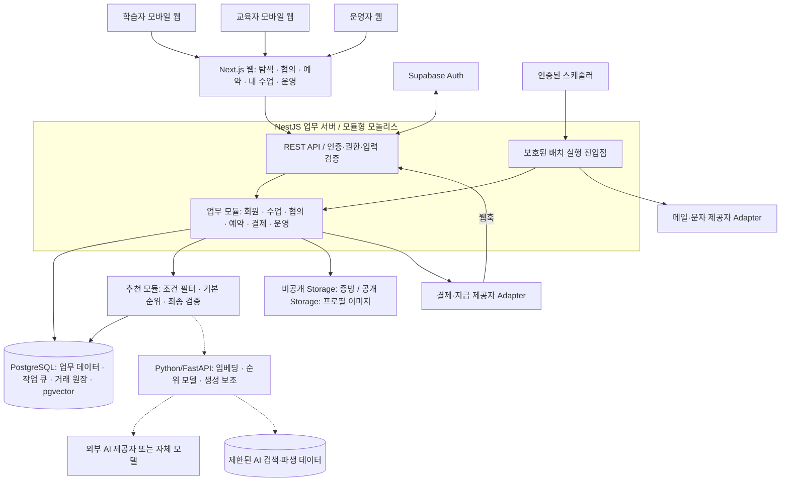
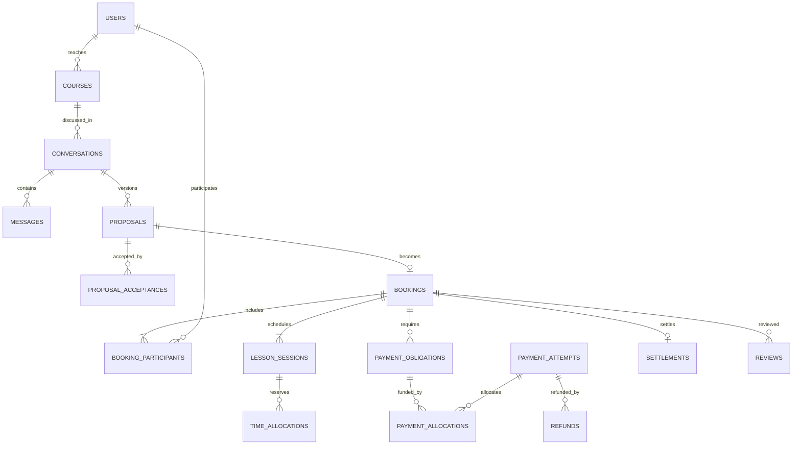
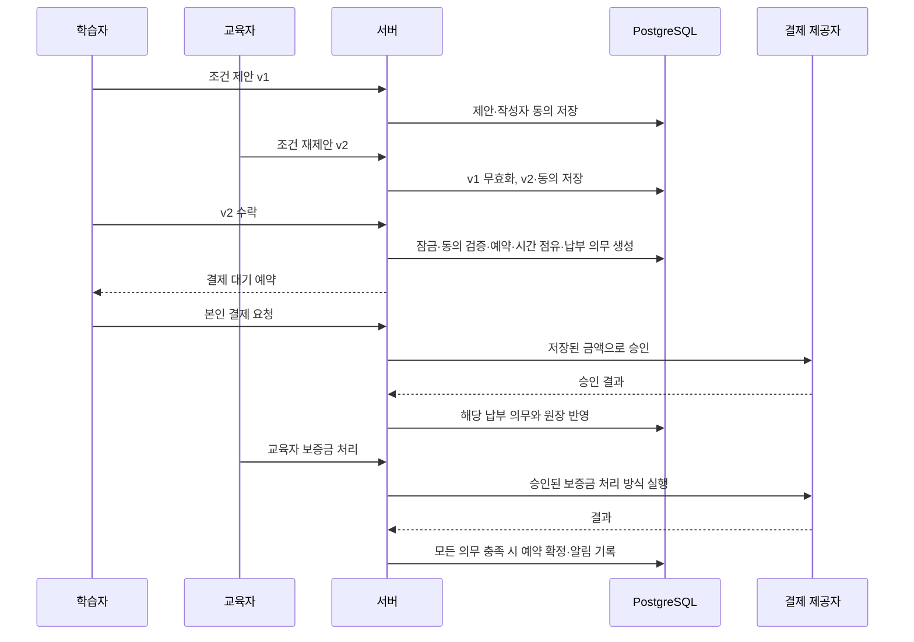
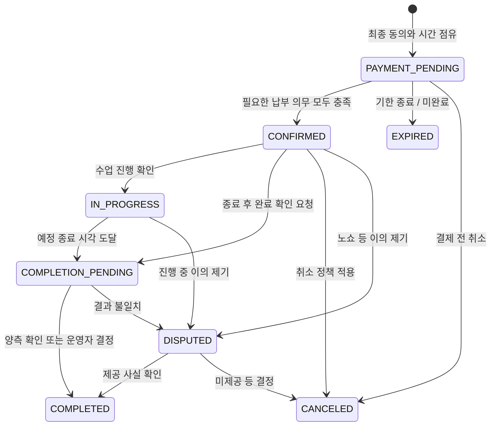

# 전공한시간 웹서비스 소프트웨어 아키텍처

작성일: 2026-09-18 · 최종 정리: 2026-09-19 · 상태: AI·추천 확장성을 반영한 제안 설계 v1.1

기준 문서: [전공한시간 MVP 사업계획서](./전공한시간_MVP_사업계획서.md)

함께 볼 문서: [AI·추천 시스템 상세 설계](./전공한시간_AI_추천_아키텍처.md)

이 문서는 사업계획서를 바탕으로 작성한 구현 제안이다. 실제 서비스 코드·계정·인프라·결제 계약을 구축한 상태가 아니다.

## 1. 권장하는 구조

**Next.js 웹 + NestJS 업무 서버 + Python/FastAPI AI 서비스 + PostgreSQL·pgvector를 권장한다.** 사용자가 요청한 AI·추천 확장성을 반영한 기본안이다. DB·인증·파일 보관은 초기 Supabase 관리형 서비스를 활용한다.

업무 서버는 **모듈형 모놀리스**로 만든다. 회원·수업·협의·예약·결제를 한 NestJS 서버 내부의 모듈로 나누고 같은 DB 트랜잭션을 사용한다. 웹과 업무 서버는 처음부터 배포 경계를 나누며, Python AI 서비스는 의미 검색·작성 보조를 도입할 때 별도로 배포한다. 첫 규칙 추천은 NestJS에서 실행한다.

초기에는 개발자 1~2명이 한 대학 생활권의 소규모 파일럿을 구현한다는 가정이다. 팀의 기술 숙련도와 예산은 아직 확인되지 않았다. Next.js만 사용하는 구성보다 서버 운영 부담은 늘지만, AI 실험·모델 교체·배치 처리의 실행 환경과 확장 단위를 분리할 수 있다. Python이 추천 품질을 자동으로 높이는 것은 아니며, 품질은 입력 정보·평가 데이터·개선 실험으로 검증한다.

이 서비스에서 가장 중요한 연결은 다음과 같다.

> 교육자 커리큘럼 → 채팅에서 조건 제안·재제안 → 같은 최종안에 양측 동의 → 합의 내용을 고정한 예약 → 수업료와 양측 보증금 처리 → 수업 완료 확인 → 반환·정산·후기

예약·돈·합의 기록을 한 PostgreSQL에서 함께 관리하면, 서로 다른 서비스 사이의 데이터 불일치 문제를 줄일 수 있다. 화면보다 먼저 **합의 버전, 예약 상태, 금액 계산, 권한**의 규칙을 고정한다.

### 구현 단계

| 단계 | 목적 | 구현 범위 | 완료 기준 |
|---|---|---|---|
| A. 대회 데모 | 핵심 흐름을 설명하고 사용성을 확인 | 예시 프로필·수업, 협의 카드, 양측 동의, 예약, 모의 결제·보증금·후기 | 두 역할로 제안→재제안→동의→예약을 끝까지 시연 |
| B. 유료 파일럿 | 소수 고객의 실제 거래 검증 | 실제 회원, 1:1 단일 차시, 메시지 저장, 일정 충돌 방지, 승인된 결제·반환·정산 방식, 운영자 업무 | 중복 결제·예약과 권한 침해를 막고 실패 거래를 복구 가능 |
| C. 확장 | 반복 이용과 공급 효율 개선 | 의미 검색·AI 작성 보조, 그룹 2~4명, 복수 차시, 실시간 알림, 개인화 추천 | 파일럿 데이터로 우선순위와 투자 효과 확인 |

1:1·단일 차시부터 유료 운영하는 것은 **이 설계의 범위 제안**이다. 사업계획서의 그룹·복수 차시 요구는 12절에 확장 모델로 남긴다. 10시간에 B 단계까지 구현된다고 가정하지 않는다.

## 2. 사업 규칙과 변경 가능한 정책

| 항목 | 문서상 성격 | 설계 반영 |
|---|---|---|
| 교육자가 커리큘럼·희망가 제시, 학습자와 가격·내용 협의 | 확정 방식 | 수업 등록과 협의 제안을 별도 데이터로 관리 |
| 최종 합의 수업료의 15%를 교육자에게 차감 | 확정 방식 | 서버가 계산하고 예약에 적용 비율·금액 저장 |
| 학습자 별도 플랫폼 수수료 없음 | 확정 방식 | 학습자 플랫폼 수수료는 0원 |
| 재제안 시 이전 제안은 확정 대상에서 제외 | 요구사항 | 제안 버전과 현재 유효 제안 ID 관리 |
| 예약 후 변경은 상대방 재동의 | 요구사항 | 기존 예약을 직접 덮어쓰지 않는 변경 요청 |
| 보증금 20%, 24시간 전 취소, 1:1 시간당 12,500원 하한 | 검증용 제안 | 버전이 있는 정책 설정, 기존 예약에 소급하지 않음 |
| 보증금은 반환 대상, 노쇼 보상은 피해 당사자 몫 | 운영안 | 수업료·보증금·보상금·수수료를 별도 항목으로 기록 |
| PG 3.4%, 건당 200원, 세금 관련 수치 | 손익 계산 가정 | 주문 청구 규칙과 분리, 실제 비용·정산 내역을 별도 집계 |
| 상호 후기 공개 시점, 이의제기 기한 | 미정 운영 정책 | 기본 파일럿은 학습자→교육자 후기, 공개 정책 별도 설정 |

`policy_versions`에는 적용 시작일, 수수료율, 보증금율, 가격 하한, 취소·노쇼 기준, 반올림 방식, 결제 대기 시간, 완료 확인 기한을 기록한다. 15%도 과거 거래를 재현하기 위해 저장하지만 현재 운영값은 사업계획서의 확정값을 따른다. 정책 변경은 관리자 권한과 변경 사유가 필요하다.

## 3. 시스템 구성도



브라우저는 업무 데이터를 NestJS API로 요청한다. Next.js는 화면 렌더링과 필요한 프록시만 담당하고 업무 규칙을 중복 구현하지 않는다. 결제, 환불, 예약 상태를 브라우저에서 DB에 직접 수정하지 않는다. 점선은 AI 도입 때 추가되는 내부 호출이며 AI 데이터는 초기 같은 PostgreSQL의 분리 스키마에 둔다.

데모와 첫 파일럿 채팅은 화면이 열려 있을 때 3~5초 간격으로 새 메시지를 가져오는 방식으로 시작할 수 있다. 이는 초기 설계값이며 실제 지연과 호출량을 보고 조정한다.

### 기술 선택

| 영역 | 기본안 | 선택 이유·제약 |
|---|---|---|
| 웹 화면 | Next.js App Router, React, TypeScript | 학습자·교육자·운영자 화면을 한 프로젝트에서 구현 |
| 서버 API | NestJS, TypeScript, REST/OpenAPI | 업무 모듈·권한·예약·결제의 단일 실행 지점 |
| 입력 검증 | Zod | 서버 입력 스키마를 명시하고 잘못된 금액·시간·상태를 거절 |
| UI | Tailwind CSS와 소규모 공통 컴포넌트 | 카드·폼·상태 배지·금액 명세 재사용 |
| DB | Supabase PostgreSQL + pgvector | 거래 DB와 수업 의미 검색을 한 저장 기반에서 시작 |
| DB 접근 | Drizzle + SQL migration | 서버에서 트랜잭션 사용, 시간 중복 제약 등은 SQL로 명시 |
| 인증·파일 | Supabase Auth / Storage | 로그인과 파일 보관을 관리형 서비스로 처리 |
| 메시지 | DB 영구 저장 + HTTP 조회 | 전송 장애 뒤에도 이력 재조회 가능 |
| AI 실행 | Python, FastAPI, Pydantic | 임베딩·추천 모델·생성 보조를 업무 서버와 분리 |
| 추천 | 초기 NestJS 규칙 → 의미 검색 결합 → Python 학습 순위 모델 | 데이터가 없는 초기에도 작동하고 단계별 효과 검증 |
| AI 작업 | PostgreSQL 영구 작업 큐 + Python worker, 필요 시 전용 브로커 | 대량 임베딩·재학습을 사용자 요청과 분리 |
| 결제 | `PaymentGateway` 인터페이스, 토스페이먼츠 후보 | 데모·테스트·실결제를 동일 업무 흐름에 연결 |
| 배치 | DB 작업 테이블 + 스케줄러가 호출하는 짧은 실행 함수 | 알림·만료·조회 재시도를 요청 응답과 분리 |
| 배포 | Next.js 호스팅 + NestJS Docker 컨테이너 + Supabase, 이후 Python 컨테이너 | 웹·거래·AI의 배포와 처리 용량을 독립 조정 |
| 검증 | Vitest, pytest, PostgreSQL 통합 테스트, Playwright | 거래 정확성 + 추천 평가 + AI 장애 격리 |

NestJS의 모듈을 업무 경계로 사용하고 명시적으로 내보낸 서비스만 다른 모듈에서 호출한다. [NestJS 공식 모듈 가이드](https://docs.nestjs.com/modules)

Next.js Route Handler를 사용하는 경우 인증 프록시 등 얇은 역할로 한정한다. 서버리스 실행 시간·연결 제약이 있으므로 지속 AI 작업은 컨테이너와 worker에서 처리한다. [Next.js 공식 BFF 가이드](https://nextjs.org/docs/app/guides/backend-for-frontend)

패키지 버전은 구현 착수 시 지원 중인 안정 버전으로 확인한 뒤 lockfile로 고정한다. 본 문서는 실제 공급자 요금이나 무료 운영 가능성을 보장하지 않는다.

## 4. 역할과 화면

회원 하나가 학습자이면서 교육자가 될 수 있다. `role = tutor` 하나로 학습자 기능을 막지 않는다. 교육자 공개·거래 가능 여부는 별도의 심사 상태로 관리한다.

편입준비생도 학습자로 이용하므로 학습자 가입에 대학 재학을 필수로 요구하지 않는다. 같은 예약에서 교육자 자신이 학습자로 참여하는 자기 거래는 허용하지 않는다.

| 역할 | 가능한 행동 | 주요 화면 |
|---|---|---|
| 방문자 | 공개 수업·교육자 조회 | 홈, 수업 탐색, 수업 상세, 공개 프로필 |
| 학습자 | 요청 작성, 메시지·제안, 동의, 본인 결제, 수업 완료 확인, 후기·신고 | 학습 요청, 협의방, 최종 합의서, 결제, 내 수업 |
| 교육자 | 프로필·커리큘럼·가능 시간 관리, 협의, 본인 보증금 처리, 완료 확인 | 교육자 등록, 수업 관리, 일정, 정산·활동 기록 |
| 운영자 | 인증 심사, 수동 매칭, 신고 처리, 환불·정산 검토 | 운영 대시보드, 심사함, 매칭함, 분쟁함, 거래 대사 |

최종 합의 화면에는 커리큘럼·목표·시간·장소·인원·수업료·학습자 보증금·교육자 보증금·수수료·정산 예정액·취소 조건을 함께 표시한다. ‘합의 완료’, ‘결제 진행 중’, ‘예약 확정’을 다른 상태로 보여준다.

공개 프로필에는 이름 일부와 학교·전공·인증 종류를 노출한다. 예약이 확정된 상대방만 필요한 범위의 실명을 확인한다. 로그인 인증, 본인 확인, 재학·전공 확인, 경력 증빙 확인은 서로 다른 상태다.

## 5. 내부 모듈 경계

각 모듈은 `application`에서 사용 사례를 실행하고, `domain`에서 규칙을 검사하며, `infra`에서 DB·외부 API를 호출한다. API 핸들러에 계산과 상태 변경을 몰아넣지 않는다. 작은 CRUD까지 모두 복잡한 추상화로 감싸지는 않는다.

| 모듈 | 소유 데이터·규칙 | 대표 사용 사례 |
|---|---|---|
| Identity | 회원, 역할, 본인·교육자 확인, 공개 범위 | 교육자 신청, 공개 프로필 생성 |
| Catalog | 과목, 커리큘럼, 희망가, 지역, 가능 시간 | 수업 등록, 시간·주제 필터 검색 |
| Matching | 학습 요청, 운영자 배정 기록 | 조건에 맞는 교육자 후보 제시 |
| Negotiation | 협의방, 메시지, 제안 버전, 동의 | 제안·재제안·수락·상담 종료 |
| Booking | 예약, 참여자, 실제 수업 회차, 시간 점유, 완료 확인 | 예약 생성, 일정 변경, 수업 완료 |
| Billing | 결제 의무, 결제 시도, 환불, 보증금, 수수료, 정산 원장 | 결제 승인, 보증금 반환, 지급 요청 |
| Trust & Operations | 후기, 신고·차단, 분쟁 결정, 감사 기록 | 신고 심사, 정산 보류·해제 |
| Notifications | 발송 작업, 시도·실패 기록 | 새 제안·예약 확정·수업 전 알림 |
| Recommendations | 자격 필터, 추천 요청·노출, 기본 순위, 모델 호출·대체 경로 | 가능한 수업 후보를 찾고 이유와 함께 제시 |
| AI 서비스 | 임베딩·모델·프롬프트 버전, 초안, 평가 결과 | 의미 유사도·순위 점수·커리큘럼 초안 반환 |

Booking이 Billing 테이블을 임의 수정하지 않고 `Billing.createObligations()` 같은 명시적 함수로 요청한다. 중요한 모듈 간 변경은 공통 트랜잭션을 전달해 한 번에 커밋한다. 외부 PG 호출은 DB 트랜잭션 밖에서 실행한다.

## 6. 데이터 모델

### 주요 테이블

아래는 **유료 파일럿 목표 모델**이다. A 단계 데모에는 핵심 수업·제안·동의·예약 및 모의 금액 처리만 구현할 수 있다. 모든 표를 10시간 안에 구축하는 계획은 아니다.

| 테이블 | 주요 필드 | 핵심 의미 |
|---|---|---|
| `users`, `user_roles` | auth_user_id, status, role | 계정과 복수 역할 |
| `private_profiles`, `tutor_profiles` | user_id, real_name, school, major, verification_status | 비공개 정보와 공개 프로필 분리 |
| `verifications` | user_id, type, status, evidence_key, reviewed_at | 인증 종류별 근거·심사 상태 |
| `courses` | tutor_id, subject_id, campus_id, curriculum, asking_price, status | 탐색용 수업 원본 |
| `availability_windows` | tutor_id, starts_at, ends_at | 교육자가 입력한 가능 시간, 예약 점유와 분리 |
| `learning_requests` | learner_id, goal, level, campus_id, desired_windows, status | 운영자 수동 매칭의 출발점 |
| `conversations`, `conversation_members` | course_id/request_id, member_id, status | 참여자 권한의 기준 |
| `messages` | conversation_id, sender_id, client_message_id, type, body, proposal_id, seq | 텍스트·제안 카드·시스템 이벤트 |
| `proposals` | conversation_id, version, proposer_id, status, terms, terms_hash, expires_at | 수정하지 않는 조건 버전 |
| `proposal_acceptances` | proposal_id, user_id, terms_hash, accepted_at | 동일 내용에 대한 개별 동의 |
| `bookings` | accepted_proposal_id, status, policy_version_id, terms_snapshot, version | 합의 내용을 고정한 거래 단위 |
| `booking_participants` | booking_id, user_id, role, tuition_amount, attendance_status | 학습자·교육자 참여 관계 |
| `lesson_sessions` | booking_id, starts_at, ends_at, venue_id, status | 실제 수업 일정, 파일럿은 예약당 1개 |
| `time_allocations` | session_id, user_id, during, state, expires_at | 학습자·교육자의 시간 점유 |
| `completion_confirmations` | session_id, user_id, result, created_at | 수업 완료·이의 제기 기록 |
| `payment_obligations` | booking_id, payer_id, purpose, amount, status | 수업료·학습자 보증금·교육자 보증금 납부 의무 |
| `payment_attempts`, `payment_allocations` | booking_id, payer_id, provider_order_id / attempt_id, obligation_id, amount | 결제 실행과 납부 의무별 금액 배분 |
| `refunds`, `deposit_dispositions` | payment_id, amount, reason, recipient_id, status | 원결제 취소와 보증금 반환·보상의 구분 |
| `settlements`, `payout_attempts` | booking_id, tutor_id, tuition, fee, payable, status | 정산 계산과 실제 지급 실행 분리 |
| `ledger_transactions`, `ledger_entries` | business_event_id, account, debit, credit, amount | 수정 대신 역거래를 추가하는 금액 원장 |
| `reviews`, `reports`, `disputes` | booking_id, author_id, target_id, status, resolution | 완료 거래에 연결한 신뢰·분쟁 정보 |
| `policy_versions`, `audit_logs` | version, payload / actor, action, entity_id, reason | 정책 재현 및 운영자 작업 추적 |
| `idempotency_records`, `webhook_events`, `outbox_jobs` | key, request_hash, state, attempts, run_after, lease_until | 중복 방지·비동기 처리·복구 |
| `course_search_documents`, `course_embeddings` | course_id, source_version, model_version, embedding | 승인된 공개 수업의 검색용 파생 데이터 |
| `recommendation_requests`, `recommendation_impressions`, `learning_events` | request_id, course_id, rank, model_version, event_id | 추천 결과·실제 노출·후속 거래의 연결 |

추천·AI 데이터의 필드, 생성·삭제·버전 전환은 [상세 설계](./전공한시간_AI_추천_아키텍처.md)를 따른다.

금액은 KRW 정수 원 단위로 저장한다. 비율은 15%=1,500 bps처럼 정수로 표현한다. 시간은 `timestamptz`로 저장하고 화면은 `Asia/Seoul` 기준으로 표시한다. 조회·제약에 필요한 상태·시간·금액은 정규 컬럼에 두고, 동의한 커리큘럼·취소 조건 사본은 JSON 스냅샷으로 보존한다.

### 핵심 관계



주요 관계만 표시한 ERD다. `courses` 없는 학습 요청 기반 협의도 허용하되, 교육자와 실제 수업 조건은 예약 전 확정해야 한다.

### DB에서 강제할 제약

- `UNIQUE(conversation_id, version)`, `UNIQUE(proposal_id, user_id)`, `UNIQUE(accepted_proposal_id)`로 제안·동의·예약 중복을 차단한다.
- 메시지의 `(conversation_id, sender_id, client_message_id)`는 유일하다. 재전송 시 기존 메시지를 반환한다.
- 제안·예약의 양수 금액과 `ends_at > starts_at`을 검사한다. 금액 원장의 거래별 차변·대변 합계는 원장 기입 함수에서 검증한다.
- `time_allocations`의 유효 점유 상태에 사용자별 시간 중복 배제 제약을 둔다. 교육자이면서 학습자인 사용자도 같은 시간의 중복 예약을 막는다.
- 시간 구간은 `[시작, 종료)`로 처리한다. 이동 여유 시간이 필요하면 점유 범위에 반영하고 사용자에게 알린다.
- PG 주문 ID와 PG 결제 키에 고유 제약을 둔다. 논리적 납부 의무에는 동시에 승인 가능한 시도를 하나만 허용한다.
- 후기에는 `(booking_id, author_id, target_id)` 고유 제약을 둔다. 작성 권한과 완료 여부도 서버에서 검사한다.

PostgreSQL의 범위 타입과 exclusion constraint를 사용하면 같은 자원에 겹치는 시간대를 DB 수준에서 거절할 수 있다. [PostgreSQL 공식 문서](https://www.postgresql.org/docs/16/rangetypes.html#RANGETYPES-CONSTRAINT)

점유 만료는 `now()`를 인덱스 조건에 넣어 해결하지 않는다. 배치와 예약 생성 트랜잭션에서 만료된 점유를 명시적으로 해제한다. 외부 결제 결과가 불확실하면 먼저 결과를 조회하고, 점유를 이미 해제한 뒤 늦게 승인된 금액은 환불 대상으로 처리한다.

## 7. 협의와 예약의 일관성

### 채팅은 대화, 제안 카드는 거래 조건

“15,000원에 해요”라는 메시지를 자동으로 계약으로 취급하지 않는다. 메시지와 연결된 구조화된 제안 카드에 다음 정보를 담는다.

```text
ProposalTerms
  curriculum: 목표, 선수 지식, 수업 범위, 결과물
  sessions: 시작·종료, 장소, 총수업 분
  participants: 교육자 ID, 학습자 ID 목록
  prices: 수업료, 수수료, 정산 예정액, 양측 보증금
  policies: 취소·노쇼·완료 확인 정책 버전
  validity: 제안 만료 시점
```

서버가 가격·정산액을 계산하고 정규화한 내용의 해시를 생성한다. 해시는 동일 내용 비교용이며 동의 기록과 인증된 사용자 ID를 대체하지 않는다.

제안 등록은 작성자의 해당 버전에 대한 동의도 함께 기록한다. 상대방 수락으로 필수 참여자의 동의가 모두 갖춰진다. 재제안은 새 버전을 만들고 기존 제안을 `SUPERSEDED`로 바꾼다. 이전 버전의 수락 요청은 `409 STALE_PROPOSAL`로 거절한다.

예약이 생성되면 해당 협의의 제안 흐름을 `AGREED`로 닫고, 메시지는 계속 주고받을 수 있게 한다. 결제 진행 중 새 제안으로 예약 조건을 바꾸지 못하게 하며, 이후 조건 수정은 변경 요청 경로를 사용한다. 재예약 상담은 별도 협의로 시작한다.

### 최종 수락 트랜잭션

1. 협의방 행을 잠그고 현재 유효 제안·참여자·만료·차단 상태를 다시 검사한다.
2. 같은 제안과 해시에 대한 수락을 기록한다. 재전송이면 기존 결과를 반환한다.
3. 필요한 동의가 모두 모이면 제안의 가격·정책·가능 시간을 검증한다.
4. 예약, 참여자, 수업 회차, 양측 시간 점유, 결제 의무, 알림 작업을 한 트랜잭션에서 생성한다.
5. 기존 제안의 중복 예약 또는 시간 충돌이면 커밋하지 않고 사유를 반환한다.
6. 커밋 후 `PAYMENT_PENDING` 예약을 보여준다. 실제 결제는 별도 과정이다.



### 예약 상태



`CANCELED`와 `EXPIRED`는 예약 상태이며, 이미 받은 돈의 환불 성공을 뜻하지 않는다. 결제·환불·보증금·정산은 별도 상태로 관리한다. `COMPLETED`도 교육자 계좌에 지급 완료됐다는 뜻이 아니다.

체크인 기록은 참고 증거다. 예정 시간이 지났거나 한쪽이 버튼을 눌렀다는 이유만으로 자동 완료·정산하지 않는다. 파일럿은 양측 확인 또는 운영자 판단으로 완료하며, 응답이 없는 건은 운영 대기열로 보낸다.

### 예약 후 변경

파일럿에서는 메시지로 변경을 협의하되, 시간·가격·범위를 기존 예약에 직접 수정하지 않는다. 운영자는 양측 동의가 연결된 변경 요청을 검토한다. 자동 변경 기능을 만들기 전에는 기존 예약의 취소·환불 경로와 새 예약을 연결한다. 원래 정책을 우회하는 취소로 처리하지 않도록 변경 사유와 합의된 비용을 남긴다.

확장 시 `booking_amendments`로 변경 버전·동의·차액 결제·차액 환불·새 시간 점유를 관리한다. 모든 조건이 충족될 때 새 버전을 활성화하고, 실패하면 기존 유효 예약을 유지한다.

## 8. 결제·보증금·정산

### 사용자에게 표시할 금액

수업료 P, 학습자 보증금 DL, 교육자 보증금 DT, 교육자 수수료 F라 할 때:

```text
학습자 수업료           = P
학습자 플랫폼 수수료    = 0
학습자 초기 납부 합계   = P + DL
교육자 초기 납부        = DT
교육자 수수료 F         = floor(P × 1500 / 10000)
교육자 정산 예정액      = P − F
정상 완료 시 반환       = 학습자 DL / 교육자 DT
```

수수료의 원 미만 버림은 이 설계의 제안이며 정책으로 확정해야 한다. 기존 계약의 적용 방식은 예약에 저장한다. 원문의 ‘학습자 결제액 P’는 수업료 부분을 뜻하고, 보증금을 실제 받는 경우 초기 납부 합계는 더 크다는 점을 UI에서 분명히 한다.

| 15,000원 수업, 보증금 20% 가정 | 금액 |
|---|---:|
| 학습자 수업료 | 15,000원 |
| 학습자 반환 예정 보증금 | 3,000원 |
| 학습자 초기 납부 합계 | 18,000원 |
| 교육자 납부 보증금 | 3,000원 |
| 교육자에게 차감할 플랫폼 수수료 | 2,250원 |
| 정상 완료 교육자 정산액 | 12,750원 |
| 정상 완료 보증금 반환 | 학습자 3,000원 / 교육자 3,000원 |

PG 비용은 플랫폼 비용으로 기록한다. 교육자에게 추가 차감하지 않는다는 원문의 계산 가정을 따른다. 15%의 세무 처리와 원천징수 여부는 별도 확정 사항이며 본 설계가 이를 결정하지 않는다. 수수료·보증금·거래 총액은 대시보드에서도 분리한다.

### 외부 제공자 경계

```text
PaymentGateway: createCheckout / confirm / getStatus / refund
DepositProvider: collect / getStatus / returnToPayer / compensate
PayoutProvider: registerSeller / requestPayout / getPayoutStatus
```

이는 내부 인터페이스 이름이며 PG에 동일한 API가 존재한다는 뜻이 아니다. 데모는 Fake 구현, 테스트는 제공자 테스트 환경, 운영은 확인된 실결제 구현을 연결한다. **교육자 보증금 수납·보관·반환과 상대방 보상은 일반 카드결제·취소 API만으로 구현 가능하다고 가정하지 않는다.**

계약 전 결정해야 할 것은 학습자 보증금을 수업료와 함께 받는지, 별도로 받는지, 교육자 보증금을 어떤 방식으로 처리하는지, 노쇼 보상을 어떻게 지급하는지다. 미확정이면 해당 실거래 기능을 비활성화하고 데모로 유지한다. 정책에서 보증금이 필요한 예약을 납부 없이 확정하지 않는다.

토스페이먼츠의 지급대행은 셀러 등록과 별도 보안·심사 절차가 있는 기능이다. 일반 결제 승인 성공을 교육자 지급 준비 완료로 해석하지 않는다. [토스페이먼츠 지급대행 공식 안내](https://docs.tosspayments.com/guides/v2/payouts)

### 결제 승인·재시도 절차

1. 인증된 납부자와 해당 의무를 확인하고, 서버의 예약 스냅샷으로 주문 ID·청구액을 저장한다.
2. 납부 의무 행을 잠그고 유효한 결제 시도를 하나만 만든다. 브라우저가 보낸 금액은 근거로 사용하지 않는다.
3. PG 호출은 DB 잠금 밖에서 실행한다. 승인 전 주문·금액·예약 유효성을 재확인한다.
4. 성공 리다이렉트만으로 결제 완료 처리하지 않고 서버에서 승인 결과를 확인한다.
5. 승인 결과를 트랜잭션으로 반영한다. 같은 성공을 다시 받아도 원장·납부·예약 상태를 중복 변경하지 않는다.
6. 타임아웃은 `UNKNOWN`으로 남겨 PG에 조회한다. 결과를 모르는 상태에서 새 주문을 만들어 다시 청구하지 않는다.
7. 한쪽만 납부하고 기한이 지나면 예약을 만료시키고 이미 받은 금액의 반환 작업을 만든다. 늦게 들어온 승인도 예약을 되살리지 않고 반환한다.

공급자는 주문 ID·금액을 서버에 저장하고 승인 시 검증하는 흐름을 제공한다. [토스페이먼츠 결제 연동 공식 문서](https://docs.tosspayments.com/guides/v2/payment-widget/integration)

우리 API의 멱등키는 `사용자 + 작업 + 키`별 요청 해시와 결과를 저장한다. 같은 키에 다른 본문이면 거절한다. PG의 멱등키도 같은 논리 작업의 재시도에서 유지한다. 제공자의 보장 기간이 끝났다고 무조건 새 키를 쓰지 말고 먼저 과거 거래를 대사한다. [토스페이먼츠 멱등키 공식 문서](https://docs.tosspayments.com/reference/using-api/authorization)

### 웹훅과 원장

- 웹훅은 중복·지연·순서 역전이 가능하다고 가정한다. 수신 이벤트를 영구 저장한 뒤 빠르게 응답하고 작업 큐에서 처리한다.
- 제공자 이벤트 식별자와 업무 거래 식별자를 각각 관리한다. 동일 결제가 다른 이벤트로 도착해도 금액을 두 번 기입하지 않는다.
- 일반 결제 알림은 서버 자격증명으로 PG의 현재 상태·주문·금액을 조회한 결과와 대조한다. 모든 이벤트에 공통 서명이 있다고 가정하지 않는다.
- 서명 검증이 제공되는 지급 이벤트는 원본 본문으로 검증한다. 제공자의 실제 이벤트별 검증 규칙을 Adapter에 구현한다.
- 결제 반영과 원장 기입 및 후속 작업 생성은 같은 DB 트랜잭션으로 처리한다.

토스페이먼츠 문서는 지급·셀러 이벤트의 서명과 일반 결제 이벤트를 구분한다. 해당 이벤트별 사양에 맞춰 검증해야 한다. [토스페이먼츠 웹훅 공식 문서](https://docs.tosspayments.com/reference/using-api/webhook-events)

원장은 수업료 보관액, 반환할 보증금, 교육자 지급채무, 수수료, 피해자 보상 지급채무를 분리한다. 원장을 지우거나 과거 숫자를 수정하지 않고 조정·역거래를 남긴다. 거래별 합계가 맞아야 하며 보증금 반환·보상 총액은 해당 보증금 잔액을 넘을 수 없다.

### 취소·분쟁·정산

미제공 수업은 원문의 운영안에 따라 수업료와 그에 해당하는 수수료를 환불·취소 대상으로 잡는다. 보증금 보상은 분쟁 결정 이후 별도로 실행한다. 원결제 취소로 상대방에게 돈이 이전되지는 않으므로, ‘원 납부자에게 반환’과 ‘피해자에게 지급’을 구분한다.

정산은 수업 제공 확인, 미해결 분쟁 없음, 결제·환불 대사 일치, 교육자 지급 가능 상태를 모두 검사한다. 분쟁 접수와 지급 요청은 같은 예약·정산 행 잠금 규칙을 사용한다. 이미 지급 요청 중이라면 취소 가능 여부를 조회하고, 이미 지급 완료된 경우 별도 회수·조정 사건으로 관리한다.

분쟁 접수 시 판단 대상 금액의 보증금 반환·보상·교육자 지급을 함께 보류한다. 반환과 보상 작업도 같은 잠금·상태 검증을 사용해 한 보증금이 원 납부자와 피해자에게 중복 지급되지 않게 한다. 분쟁과 무관하게 확정된 반환분은 운영 결정으로 분리 처리할 수 있다.

부분 환불 도입 시 최종 유효 수업료 기준으로 수수료를 다시 계산하고 이미 기록한 수수료와의 차이를 역기입한다. 매번 부분 금액에 반올림하여 누적 오차를 만들지 않는다. 초기 파일럿의 부분 제공·부분 환불은 운영자가 검토한다.

## 9. API 설계

상태를 직접 `PATCH`하는 범용 API 대신 동의·취소·완료 같은 업무 행동을 명시한다. 다음은 구현 기준 목록이며 전체 OpenAPI 명세는 후속 구현 단계에서 작성한다.

| 메서드·경로 | 기능 | 권한·검증 |
|---|---|---|
| `GET /api/courses` | 주제·지역·시간 필터 | 공개 필드만 반환, 커서 페이지네이션 |
| `POST /api/recommendations/query` | 목표·시간·지역 기반 추천 | 공개 가능·예약 조건 재검증, 실패 시 기본 추천 |
| `POST /api/ai/curriculum-drafts` | 커리큘럼 초안 생성 작업 | 교육자 본인, 사용량 제한, 작업 ID 반환 |
| `GET /api/ai/jobs/:id` | 본인 AI 작업 결과 | 작업 소유자만 조회, 공개 전 본인 확정 |
| `POST /api/tutor/courses` | 커리큘럼 등록 | 교육자 본인, 공개 전 심사 상태 검사 |
| `PUT /api/tutor/availability` | 가능 시간 수정 | 본인, 확정 예약은 변경 불가 |
| `POST /api/learning-requests` | 학습 요청 | 학습자 본인 |
| `POST /api/conversations` | 협의방 시작 | 참여 가능·차단 상태 검사 |
| `GET/POST /api/conversations/:id/messages` | 메시지 조회·저장 | 현재 참여자, 전송 제한, 중복 키 |
| `POST /api/conversations/:id/proposals` | 새 제안·재제안 | 참여자, 서버 가격 검증 |
| `POST /api/proposals/:id/accept` | 특정 버전 동의 | 참여자, 최신 버전·해시·만료 검사 |
| `GET /api/bookings/:id` | 합의·결제·수업 상태 조회 | 해당 참여자·업무 권한 운영자 |
| `POST /api/bookings/:id/payment-attempts` | 본인 납부 의무 결제 | payer 일치, 멱등키 |
| `POST /api/payments/:id/confirm` | PG 승인 요청 | 주문 소유자·금액·현재 상태 검사 |
| `POST /api/bookings/:id/cancel-requests` | 취소 요청 | 당사자, 저장된 취소 정책 |
| `POST /api/bookings/:id/change-requests` | 변경 합의 요청 | 당사자, 기존 버전 기록 |
| `POST /api/sessions/:id/completion-confirmations` | 완료 확인·이의 | 해당 회차 참여자 |
| `POST /api/bookings/:id/reviews` | 후기 | 실제 완료된 참여자 |
| `POST /api/reports` | 신고 | 신고자 본인, 증거 접근 제한 |
| `POST /api/admin/disputes/:id/resolve` | 분쟁 결정 | 운영 권한, 사유·증거·감사 기록 |
| `POST /api/admin/settlements/:id/release` | 정산 승인 | 재무 권한, 분쟁·환불 재확인 |
| `POST /api/webhooks/payments` | 외부 상태 수신 | 이벤트별 검증·중복 방지 |
| `POST /api/internal/jobs/run` | 짧은 배치 실행 | 스케줄러 전용 인증 |

공통 오류는 `code`, 사용자용 `message`, 추적용 `requestId`를 반환한다. 예: `STALE_PROPOSAL`, `SCHEDULE_CONFLICT`, `PAYMENT_AMOUNT_MISMATCH`, `PAYMENT_RECONCILIATION_REQUIRED`. 화면은 오래된 제안이면 최신안을 다시 보여주고, 결과 불명 결제면 ‘확인 중’으로 표시한다.

## 10. 권한·개인정보·운영

### 데이터 접근

업무 테이블은 브라우저에 직접 노출하지 않는 스키마에 둔다. 서버의 전용 DB 계정에 필요한 권한만 부여하고, 모든 사용 사례에서 세션 사용자·리소스 참여 관계·현재 상태를 검사한다. 서버 DB 연결이 사용자 JWT의 RLS를 자동 적용한다고 가정하지 않는다.

Data API를 쓰지 않는 업무 스키마는 노출 대상에서 제외한다. 추후 직접 조회를 허용할 테이블이 생기면 grants와 RLS를 함께 설계하고 허용·거부 테스트를 추가한다. Supabase의 서비스 키는 RLS를 우회하므로 브라우저에 전달하지 않는다. [Supabase 데이터 접근 보안](https://supabase.com/docs/guides/database/secure-data), [Supabase RLS](https://supabase.com/docs/guides/database/postgres/row-level-security)

로그인 세션은 서버에서 검증한다. 쿠키 인증 경로는 Secure·HttpOnly·SameSite 설정과 변경 요청의 Origin/CSRF 검증을 적용한다. 운영자 계정에는 추가 인증과 명시적 업무 권한을 적용한다. 교육자는 자기 정산만, 학습자는 자기 납부만 볼 수 있다.

| 데이터 | 접근 범위 |
|---|---|
| 공개 수업·프로필 | 공개용 응답 필드만 허용 |
| 메시지·제안 | 해당 방 참여자, 사건 담당 운영자만 필요한 범위 |
| 실명 | 본인, 확정 예약의 상대방, 필요한 업무 권한 운영자 |
| 신원·재학 증빙 | 본인과 심사 담당, 비공개 저장소·짧은 다운로드 권한 |
| 결제·계좌 관련 정보 | 본인과 재무 담당, 제공자 식별자를 우선 저장 |
| 신고 내용 | 신고자·담당 운영자, 상대방에게는 답변에 필요한 내용만 |

학생증·신분증 원본은 데모에서 수집하지 않는다. 실제 확인 기능은 제공자 또는 운영 절차를 확정한 뒤 필요한 최소 항목만 수집한다. 재학 확인을 교육 능력 보증으로 표시하지 않는다.

증빙 보관 기간·삭제 시점·분쟁 중 보존 예외는 실제 운영 정책으로 정한다. 탈퇴 시 공개 프로필은 숨기고, 보존해야 할 거래 기록과 삭제할 개인 자료를 분리한다. 채팅 본문·증빙·실명·인증 토큰을 일반 로그나 분석 이벤트에 넣지 않는다.

업로드는 파일 종류·크기 제한과 비공개 저장을 적용한다. 초기 채팅 첨부는 비활성화해 텍스트·제안 카드에 집중한다. 차단 후 신규 메시지·예약은 막되 기존 거래의 완료·환불·분쟁 처리 경로는 남긴다.

### 운영자가 반드시 처리할 수 있어야 하는 업무

- 교육자 확인 신청 승인·반려와 사유 기록.
- 학습 요청의 수동 매칭, 후보 없음·대기 상태 안내.
- 한쪽만 결제한 예약, 완료 미응답, 결제 결과 불명 건 조회.
- 신고 근거와 당사자 답변 확인, 정산 보류 및 결정 기록.
- 환불 실패·보증금 반환 실패·지급 실패의 재처리.
- 모든 수동 금액 변경의 근거, 담당자, 이전·이후 상태 기록.

## 11. 배포·작업 처리·관측

### 환경 분리

`local/test`, `demo/staging`, `production`의 DB·Storage·인증 설정·결제 키를 분리한다. 데모 도메인에는 ‘예시 데이터 / 모의 결제’ 표시를 고정한다. `PAYMENT_MODE=fake|test|live`는 서버 설정이며 클라이언트가 바꿀 수 없다. 데모 환경에서 실결제 키를 사용하거나 운영 환경에 예시 거래를 넣는 배포는 차단한다.

웹은 Next.js 지원 호스팅, 업무 API는 NestJS Docker 컨테이너, AI 도입 이후 FastAPI와 Python worker는 별도 컨테이너로 배포한다. API와 DB는 가능한 가까운 리전으로 배치하고 DB 연결 풀·최대 연결 수를 설정한다. `apps/web`, `apps/api`, `services/ai`별 CI와 배포를 분리한다.

브라우저에는 동일 사이트의 `/api` 경로로 업무 API를 노출하는 방식을 우선한다. 쿠키 인증, Origin 검사, 프록시 타임아웃을 통일한다. FastAPI는 브라우저에 공개하지 않고 내부 통신 인증·네트워크 접근 제한을 둔다. API 인스턴스의 메모리에 세션·예약 잠금·결제 상태를 보관하지 않는다. Next.js도 필요하면 Node.js/Docker로 자체 호스팅할 수 있다. [Next.js 자체 호스팅 가이드](https://nextjs.org/docs/app/guides/self-hosting)

### 작업 큐와 장애 복구

처음에는 별도 Redis·메시지 브로커를 두지 않는다. 상태 변경 트랜잭션에 `outbox_jobs`를 같이 기록하고, 인증된 스케줄러가 제한된 크기의 작업 묶음을 실행한다.

```text
outbox_jobs
  id, type, entity_id, payload, dedupe_key
  state: PENDING / PROCESSING / SUCCEEDED / FAILED
  attempts, run_after, lease_until, last_error
```

작업 선점은 행 잠금과 `SKIP LOCKED`로 처리한다. 선점한 뒤 잠금을 풀고 외부 API를 호출한다. 실행이 끊긴 작업은 lease 만료 후 다시 가져간다. 적어도 한 번 실행될 수 있으므로 이메일 중복 억제 키와 PG 멱등키를 유지한다. 영구 실패는 운영 대기열로 옮긴다.

주요 작업은 예약 점유 만료, 결제 결과 조회, 환불·반환·정산, 미응답 수업 안내, 알림 전송이다. 파일럿은 운영자 수동 재실행도 제공한다. 금융 작업을 브라우저 타이머나 응답 후 메모리 작업에 맡기지 않는다.

### 측정과 목표

| 영역 | 초기 목표·관측 항목 |
|---|---|
| 사용 경험 | 핵심 조회 API p95 1초 이내를 목표, 외부 PG 대기 별도 측정 |
| 정확성 | 동일 수락·결제·웹훅의 반복에도 유효 예약·금액 기록 중복 0건 |
| 운영 | 실패 환불·지급, UNKNOWN 결제, 미처리 작업의 건수·최장 대기 시간 |
| 보안 | 타 사용자 거래·채팅·증빙 접근 거부 테스트, 운영자 작업 감사 |
| 가용성 | 파일럿 내부 목표 월 99.5%, 실제 측정 전 보장으로 광고하지 않음 |
| 복구 | 파일럿 목표 RPO 24시간 이내, RTO 4시간 이내; 결제 원장은 PG 대사로 보완 |

RPO/RTO는 제안 목표다. 유료 운영 전 계약한 DB 백업·시점 복구 기능과 실제 복원 시험으로 달성 가능성을 확인한다. DB 백업과 Storage 파일 백업은 별도로 확인하고, 작업 큐·감사 기록도 복구 범위에 넣는다. 복구 직후 정산을 보류한 상태에서 PG 내역과 대사한다.

사업 지표는 수업 조회→협의 시작→최종 합의→결제 충족→완료→재예약으로 연결한다. 희망 조건 일치율, 교육자 응답 시간, 취소·노쇼, 완료 수강 건수, 실수수료·실비용을 기록한다. 소규모 파일럿에서는 비율 옆에 분자·분모를 표시하고 예시 데이터는 제외한다.

## 12. 그룹·복수 차시·실시간·AI 확장

### 그룹 2~4명

그룹은 1:1 예약의 인원 숫자만 늘려서 처리하지 않는다. `group_offerings`와 `enrollments`를 추가하고 공통 조건·정원·최소 인원·마감·인원별 가격표·참여자별 결제 의무를 관리한다.

권장 첫 그룹 방식은 모집 단계에서 참여 의사를 받고, 마감 후 참여 명단·인원별 금액을 담은 최종안을 모두에게 동의받는 방식이다. 이후 정해진 결제 기한 내 최소 인원이 납부했는지 검사한다. 인원이 달라져 조건 변경이 필요하면 새 제안·재동의 또는 취소·환불로 진행한다.

- 좌석 확보는 해당 그룹 행을 잠그고 남은 좌석을 검사한다. 같은 회차의 교육자 시간 점유는 한 번만 만든다.
- 보증금 20% 정책을 채택한다면 교육자 보증금은 확정 전체 수업료 기준이다. 학습자별 보증금과 별도로 계산한다.
- 최소 인원 미달 시 참가자에게 재조정·환불 선택지를 제공한다. 참석자의 가격을 자동으로 올리지 않는다.
- 참석자 감소에도 기존 조건으로 수업을 진행할 수 있는 기준을 사전에 동의받는다. 노쇼 보상 배분 총액은 실제 보증금 잔액을 넘지 않는다.
- 공개 그룹 정보와 개별 학생의 결제·상담 정보를 구분한다. 다른 학습자의 개인 상담·신원 자료는 공유하지 않는다.

### 복수 차시

예약 1개 아래 여러 `lesson_sessions`를 둔다. 총가격·총시간과 함께 회차별 배분 금액, 취소·부분 제공·중도 종료의 환불 기준을 확정한 뒤 활성화한다. 완료 확인·출석·노쇼는 회차별로 기록하고, 활동 시간은 실제 완료된 회차에서만 계산한다.

### 실시간 채팅

폴링 비용·지연이 문제가 되면 Supabase Realtime을 전달 계층으로 추가한다. 영구 메시지 저장은 기존 DB를 유지한다. 브라우저 구독은 회원·방별 권한을 검증하고, 이벤트에는 필요한 식별자만 담아 상세 내용은 서버 API에서 다시 조회하는 방식을 권장한다.

재접속 시 `last_seq` 이후 메시지를 조회하여 누락을 복구한다. 실시간 채널의 도착 순서를 계약의 순서로 사용하지 않는다. 채널 권한과 DB 권한을 각각 설계하고, 차단·권한 회수 시 기존 연결도 갱신·종료한다. [Supabase Realtime 권한 공식 문서](https://supabase.com/docs/guides/realtime/authorization)

### AI와 외부 연동

AI와 추천은 [별도 상세 설계](./전공한시간_AI_추천_아키텍처.md)에 정의한다. 필수 조건을 만족하는 수업 후보를 NestJS가 결정하고, pgvector 의미 검색과 Python 순위 모델은 후보를 정렬하는 데 사용한다. AI 장애 시 기본 추천을 유지하며 예약·결제는 영향을 받지 않는다.

AI는 입력 사실을 바탕으로 프로필·커리큘럼 초안을 제안한다. 저장·공개는 교육자가 검토해 확정한다. AI가 인증 상태·경력·가격 합의·환불 결정을 생성하지 않는다. 인증 자료와 개인 상담 내용을 기본 입력으로 보내지 않는다.

에브리타임 시간표는 사용자가 직접 입력한 가능 시간으로 대체한다. 공식 연동 권한이 확보되기 전에는 별도 계정·비밀번호 수집이나 비공식 연동을 전제하지 않는다. 공간은 운영자가 확인한 장소 목록부터 제공하고, 실제 공간 예약 시스템은 별도 Adapter로 추가한다.

## 13. 권장 코드 구조

```text
campus-major-tutoring-mvp/
├─ apps/
│  ├─ web/                  # Next.js: 공개·회원·교육자·운영자 화면
│  ├─ api/                  # NestJS: 아래 업무 모듈
│  │  └─ src/modules/
│  │     ├─ identity/
│  │     ├─ catalog/
│  │     ├─ matching/
│  │     ├─ negotiation/
│  │     ├─ booking/
│  │     ├─ billing/
│  │     ├─ trust/
│  │     ├─ recommendations/
│  │     └─ notifications/
│  └─ worker/               # 필요 시 분리하는 업무 배치 실행 프로그램
├─ services/
│  └─ ai/                   # Python/FastAPI: AI 도입 시 활성화
│     ├─ app/               # embed·rank·draft 내부 API
│     ├─ workers/           # 영구 작업 큐 소비
│     ├─ training/          # 오프라인 학습, 데이터 확보 후
│     └─ evaluation/        # 한국어 질의·추천 품질 평가
├─ packages/
│  ├─ contracts/            # OpenAPI와 생성된 TS/Python 클라이언트
│  ├─ domain/               # money·time·업무 공통 규칙
│  └─ ui/                   # 제안 카드·금액 명세·상태 표시
├─ db/
│  ├─ schema/
│  ├─ migrations/           # 테이블·제약·권한을 코드로 관리
│  └─ seeds/                # demo 전용 예시 데이터
├─ tests/
│  ├─ domain/
│  ├─ integration/
│  └─ e2e/
└─ docs/                    # API·운영 절차·정책 결정 기록
```

저장소는 하나로 유지하되 웹·업무 API·AI의 배포 단위는 분리한다. TypeScript는 pnpm workspace, Python은 독립 환경·lockfile을 사용한다. 언어 간 계약은 OpenAPI로 공유하며 TypeScript 타입을 Python에 직접 가져오지 않는다. 업무 worker는 같은 도메인 모듈을 가져오고 AI worker는 제한된 AI 데이터만 다룬다.

## 14. 구현 순서와 검증 기준

### A 단계: 10시간 대회 데모용 기술 일정 제안

| 시간 | 개발 내용 | 확인할 결과 |
|---|---|---|
| 0~1h | 역할·정책 상수·예시 수업·화면 연결 정의 | 한 시나리오의 입력과 결과 합의 |
| 1~3h | 수업 탐색·상세·교육자 프로필 | 주제·시간·가격 확인 가능 |
| 3~6h | 협의방·제안·재제안·양측 수락 | 이전 제안 무효화, 최종안 고정 |
| 6~8h | 예약·모의 수업료·보증금·정산 명세 | 15,000원 예시 금액 정확히 표시 |
| 8~10h | 완료·후기 예시, 역할별 시연·수정 | 예시·모의 표시와 전체 흐름 확인 |

모의 대화에 실제 사람 간 전송이 없다면 화면에 표시한다. 시간이 부족하면 AI·실시간·실결제를 제외하고 제안→합의→예약 연결을 우선한다. 이 일정은 개발 범위 제안이며 조사·발표를 대신하지 않는다.

### B 단계: 유료 파일럿의 의존 순서

1. 회원·교육자 심사·공개 범위·운영자 권한.
2. 수업·시간·학습 요청, 운영자 매칭, 조건 기반 추천과 노출 이벤트 수집.
3. 영구 메시지·제안 버전·동의·시간 점유·예약.
4. 확정한 결제·양측 보증금 정책의 테스트 연동, 웹훅·원장·대사.
5. 수업 완료·취소·분쟁·환불·정산·후기·알림.
6. 운영자 예외 처리, 백업 복원, 아래 실패 시나리오 검증 후 제한된 파일럿.

실결제 연동은 위 4번의 코딩만 끝났다고 켜지 않는다. 제공자가 허용한 자금 흐름, 실제 취소·환불 정책, 교육자 지급 준비, 운영자 처리 경로가 함께 준비되어야 한다.

### 반드시 검증할 사례

| 시나리오 | 기대 결과 |
|---|---|
| 재제안과 이전 제안 수락이 동시에 발생 | 최신 유효 제안만 예약 가능 |
| 마지막 수락 버튼 중복 클릭 | 예약·납부 의무 한 세트 생성 |
| 같은 교육자 또는 학습자의 겹치는 시간 예약 | 한 건만 점유 성공 |
| 다른 사람의 채팅·예약 ID로 요청 | 조회·수정 모두 거절 |
| 클라이언트에서 결제액·수수료 조작 | 서버 금액과 불일치하면 거절 |
| 결제 성공 후 DB 응답 실패 | 조회·대사로 복구, 재청구 없음 |
| 승인·취소 웹훅의 중복·순서 역전 | 제공자 현재 상태와 금액을 한 번만 반영 |
| 학습자 납부 후 교육자 보증금 미납 | 기한 후 만료, 받은 금액 반환 처리 |
| 점유 해제 뒤 늦은 결제 성공 | 예약 부활 없이 환불 대기 |
| 취소·분쟁과 정산이 동시에 실행 | 지급 상태를 잠금·확인, 미해결 분쟁 지급 차단 |
| 정상 완료 | 수업료 15% 차감, 양측 보증금 전액 반환 |
| 제공하지 않은 수업의 노쇼 확정 | 수업료·수수료 취소, 보증금 한도 내 보상 |
| 작업 실행 중 서버 종료 | lease 만료 후 재시도, 중복 금전 처리 없음 |
| 수강하지 않은 계정 또는 미완료 예약의 후기 | 작성 불가 |
| 정책 변경 후 과거 예약 조회 | 예약 당시 조건·금액 유지 |
| 데모 환경 실결제 키 또는 운영 예시 데이터 | 배포·실행 차단 |
| AI 타임아웃·잘못된 후보 ID 반환 | 기본 추천으로 전환, 자격 없는 수업은 노출하지 않음 |
| 교육자 비공개·수업 삭제 뒤 오래된 추천 캐시 | 최신 공개 상태 재검증으로 노출 차단 |

단위 테스트는 금액 계산·상태 전이·제안 유효성에 집중한다. 실제 PostgreSQL 통합 테스트로 잠금·고유 제약·시간 충돌·원장을 확인한다. 브라우저 테스트는 두 역할의 전체 예약 흐름과 권한 경계 위주로 구성한다.

## 15. 기술 선택을 바꿔야 하는 경우

| 조건 | 대안 | 유지할 설계 |
|---|---|---|
| 팀이 Java/Spring에 익숙함 | Next.js 화면 + Spring Boot 모듈형 모놀리스 + PostgreSQL | 제안·동의·예약·원장 모델과 상태 전이 |
| AI 없이 10시간 시연만 필요 | Next.js 화면 + 모의 Adapter, Python 미배포 | 합의·예약 명세, 실거래와 모의 구분 |
| 배치가 실행 시간 제한을 자주 초과 | 전용 Node worker + 작업 큐 | outbox·멱등성·대사 절차 |
| 채팅 지연·폴링 부하가 실제 문제 | 관리형 Realtime 추가 | DB 메시지 이력·버전·권한 |
| 검색 부하·관련도 요구가 DB를 초과 | 전용 검색 인덱스·벡터 저장소 추가 | PostgreSQL을 원본 데이터로 유지 |
| 여러 팀의 독립 배포가 꼭 필요 | 부하와 책임 경계가 명확한 모듈부터 분리 | 거래 일관성·감사·복구 계약 |

초기에는 전용 검색엔진·자체 학습 추천 모델·Kafka·Kubernetes·업무별 DB를 추가하지 않는다. 규칙 추천과 선택적 의미 검색부터 평가한다. 규모가 작아도 필요한 것은 거래 정확성과 운영자 복구 경로다. 더 세분화된 서비스 분리는 실제 병목·팀 경계가 확인될 때 진행한다.

## 16. 착수 전 결정할 항목

지금의 구조 설계와 데모 개발은 아래 항목이 미정이어도 시작할 수 있다. 실제 거래 기능은 해당 정책이 확정된 뒤 활성화한다.

| 결정 항목 | 현재 설계의 가정 | 영향을 받는 부분 |
|---|---|---|
| 팀 주력 기술·개발 인원 | Next.js·NestJS 기본, AI용 Python 학습·담당 필요 | 일정과 역할 분담 |
| 한국어 AI 모델·비용 한도 | 제공자 교체 가능한 Adapter, 평가 후 모델 선택 | 임베딩 차원·생성 품질·요청당 비용 |
| 초기 수업 범위 | 1:1, 예약당 1회, 한 대학 생활권 | 상태·일정·환불 복잡도 |
| 보증금 운영과 제공자 지원 | 20%는 예시, 실제 수납 방식 미정 | 결제 확정·반환·보상 |
| 취소·노쇼·완료 확인·이의 기한 | 원문의 검증안과 수동 심사 | 정책 버전·정산 시점 |
| 본인·재학 확인 방식과 연령 정책 | 외부 확인 또는 운영 심사, 제공자 미정 | 가입·증빙·개인정보 처리 |
| 공간 사용 허용·공간비 | 확인된 장소 목록, 공간비 별도 | 장소 정보·금액 명세 |
| 정산 방식·세무 처리 | 15% 차감 계산, 지급·세무 세부 미정 | 정산 내역·실제 지급액 표시 |
| 운영 예산·지원 시간·배포 지역 | 아직 미정 | 호스팅·백업·알림·복구 목표 |

**첫 구현의 중심은 ‘수업 목록 → 협의 카드 → 양측 동의 → 변경되지 않는 예약 명세’다.** 이 흐름을 먼저 완성하고, 검증된 결제·운영 절차를 연결하면 데모에서 실제 파일럿으로 같은 모델을 확장할 수 있다.
